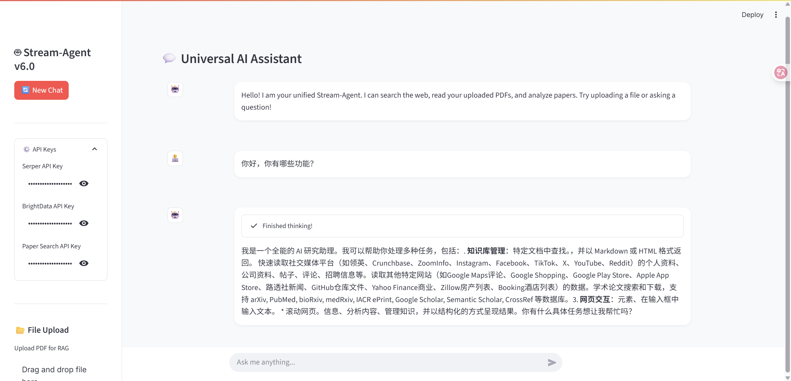
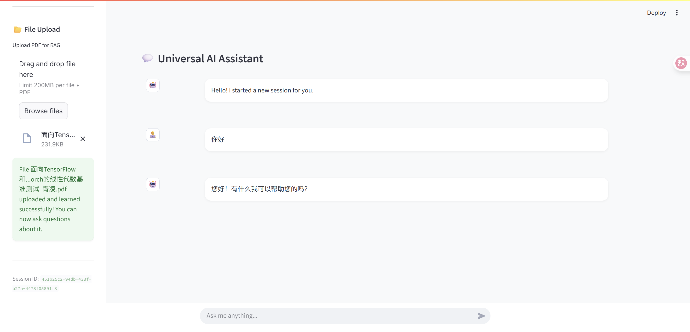
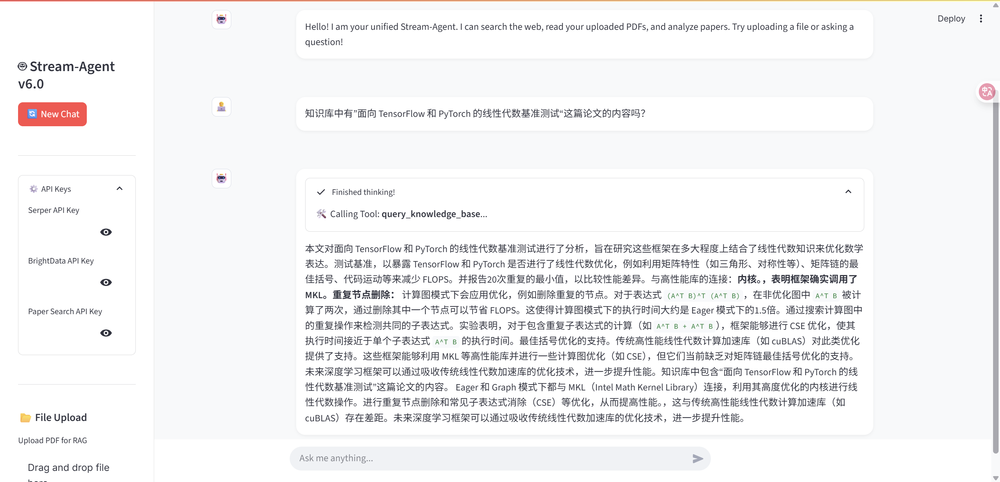
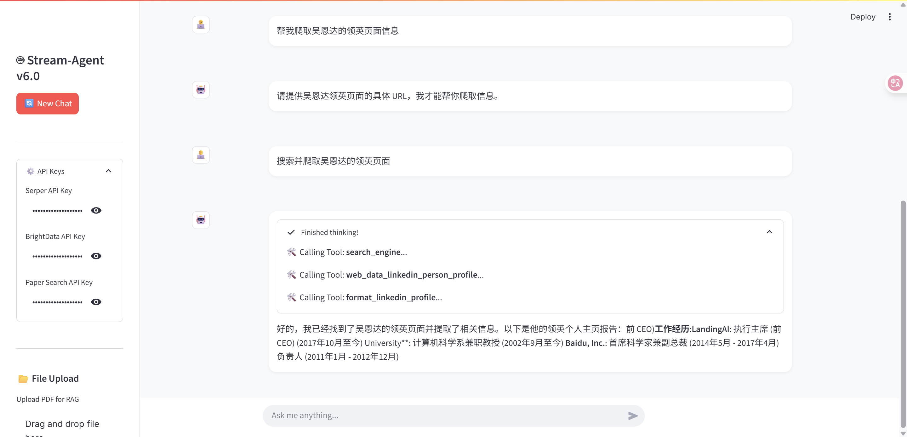
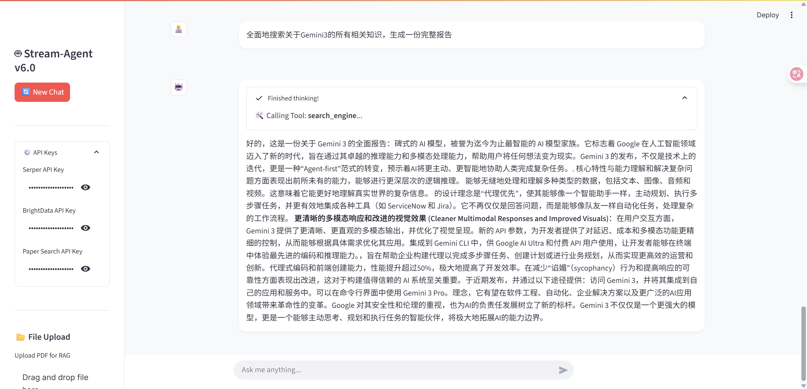

# My-Chat-LangChain v6.0 - 实时流式 Agentic RAG 平台完全开发与使用手册

---

## 1. 项目概述 (Project Overview)

**My-Chat-LangChain v6.0** 是一次全面的体验升级，将项目从 v5.0 的 Agentic RAG 平台提升为具备 **实时流式响应** 和 **过程可视化** 能力的下一代 AI 助手。用户现在可以实时看到 Agent 的思考过程，包括工具的调用、执行和结果，极大地增强了交互的透明度和沉浸感。

v6.0 不仅保留了 v5.0 的所有核心功能（Agentic RAG, MCP 工具集成, 结构化输出），还通过 Server-Sent Events (SSE) 技术对前后端通信进行了重构，实现了真正的流式对话体验。

**v6.0 核心特性：**
*   **🚀 实时流式响应 (Real-time Streaming):** 后端通过 SSE 协议实时推送 LLM 生成的 token 和工具事件，前端 `st.write_stream` 优雅地展示完整思考链。
*   **透明的过程可视化 (Transparent Process Visualization):** 在前端界面中，用户可以清晰地看到 Agent 何时开始调用工具（如网页搜索、论文分析）、何时结束以及工具的输出结果，一切尽在掌握。
*   **🤖 统一的通用智能体 (Unified Universal Agent):** 依旧强大的 ReAct Agent，能够自主规划、调用多种工具（网页搜索、PDF问答、网页爬虫、论文检索）来完成复杂任务。
*   **🔌 强大的生态集成 (Powerful Ecosystem Integration):** 无缝集成 Serper、BrightData、PaperSearch 等外部服务，赋予 Agent 感知和操作真实世界数据的能力。
*   **📂 即时文件处理 (Instant File Processing):** 用户上传的 PDF 文件会被后端立即处理和向量化，为 RAG（检索增强生成）提供即时知识。
*   **🎨 优化的前端交互 (Optimized Frontend Interaction):** UI 经过微调，支持动态 API Key 配置、一键新对话和结构化数据（如论文分析）的自动卡片式渲染。

---

## 2. 系统架构 (System Architecture)

### 2.1 架构图 (v6.0)

v6.0 架构的核心是引入了 **Server-Sent Events (SSE)** 来实现服务器到客户端的单向实时数据流。

```text
[ 用户 (Browser) ]
       |
       |  1. 发送 Prompt (HTTP POST)
       v
[ Streamlit 前端 (Frontend) ]
       |  - app.py
       |  - style.css
       |
       |  2. 向后端发起 /chat/stream 请求
       |
       +---------------------> [ FastAPI 后端 (Backend) ]
                                     |  - main.py
                                     |
                                     +--> [ Agent 服务 (LangGraph) ]
                                            |   - agent_service.py
                                            |
                                            +-- 🧠 思考 (LLM, e.g., Gemini)
                                            |
                                            +-- 🛠️ 工具箱 (Toolbox)
                                            |     |-- 🔍 搜索工具 (Serper)
                                            |     |-- 🕷️ MCP 工具 (BrightData/PaperSearch)
                                            |     |-- 📚 RAG 工具 (Ingest/Query)
                                            |
[ Streamlit 前端 ] <--------------------+  3. 通过 SSE 实时返回数据流
       |  - st.write_stream()             |     - "event: tool_start", "data: ..."
       |  - st.status()                   |     - "event: tool_end", "data: ..."
       |                                  |     - "data: (LLM token)"
       v
[ 渲染给用户 ]
  - 实时文本流
  - 工具调用状态
```

### 2.2 核心依赖版本 (Core Dependencies)

根据 `pip list` 输出，本项目的运行依赖以下核心库的特定版本：

*   **Python:** 3.11+

*   **Web 框架 (Backend & Frontend):**
    *   `fastapi: 0.116.1`
    *   `uvicorn: 0.35.0`
    *   `streamlit: 1.46.1`
    *   `requests: 2.32.4`
    *   `aiosqlite: 0.21.0` (异步数据库操作)

*   **LangChain 生态 (Agent & LLM):**
    *   `langchain: 0.3.27`
    *   `langchain-core: 0.3.76`
    *   `langchain-community: 0.3.29`
    *   `langchain-google-genai: 2.1.9` (作为示例)
    *   `langgraph: 0.6.6`

*   **RAG (检索增强生成):**
    *   `langchain-chroma: 0.2.5` (向量数据库)
    *   `langchain-huggingface: 0.3.1`
    *   `sentence-transformers: 5.1.1` (文本嵌入模型)
    *   `FlagEmbedding: 1.3.5`
    *   `flashrank: 0.2.10` (轻量级重排器)
    *   `pypdf: 5.8.0` (PDF 文档加载)

*   **MCP (模型上下文协议):**
    *   `langchain-mcp-adapters: 0.1.11`
    *   `mcp: 1.13.1`
    *   `fastapi-mcp: 0.4.0`

*   **数据处理与其他:**
    *   `numpy: 2.3.1`
    *   `pydantic: 2.11.7`
    *   `beautifulsoup4: 4.13.4`
    *   `python-dotenv: 1.1.1`

---

## 3. 目录结构 (Directory Structure)

```
My-Chat-LangChain/
├── backend/                        # 后端服务
│   ├── .env                        # 环境变量 (API Keys)
│   ├── main.py                     # FastAPI 入口 (路由定义)
│   ├── agent_service.py            # LangGraph Agent 核心服务
│   ├── langchain_qa_backend.py     # RAG 处理逻辑 (文件处理、向量化)
│   ├── tools/                      # Agent 工具集
│   │   ├── rag_tools.py
│   │   ├── search_tools.py
│   │   └── structure_tools.py
│   └── temp_uploads/               # 临时存放上传的文件
│
├── frontend/                       # 前端应用
│   ├── .streamlit/                 # Streamlit 配置文件 (可选)
│   ├── app.py                      # Streamlit UI 和交互逻辑
│   └── style.css                   # 自定义 CSS 样式
│
└── README-V6.md                    # 本说明文档
```

---

## 4. 环境安装与配置 (Installation & Setup)

### 4.1 前置要求
*   Python 3.10 或更高版本
*   Anaconda 或 Miniconda (推荐)
*   Google Gemini API Key (或其他 LangChain 支持的 LLM Key)
*   (可选) Serper, BrightData, PaperSearch API Keys

### 4.2 后端环境

1.  **创建并激活虚拟环境:**
    ```bash
    conda create -n StreamAgent python=3.11
    conda activate StreamAgent
    ```

2.  **安装依赖:**
    进入 `backend` 目录，安装所有必需的库。
    ```bash
    cd backend
    pip install "fastapi" "uvicorn[standard]" python-dotenv langchain langgraph langchain-google-genai langchain-mcp-adapters nest_asyncio langchain-huggingface sentence-transformers langchain-chroma beautifulsoup4 tqdm FlagEmbedding flashrank numpy pypdf
    ```

3.  **配置环境变量:**
    在 `backend` 目录下创建 `.env` 文件，至少填入您的 LLM API Key。
    ```env
    # .env
    GOOGLE_API_KEY=your_google_api_key_here
    ```
    *注：其他 Keys (Serper, BrightData) 推荐在前端 UI 动态输入。*

### 4.3 前端环境

1.  **安装依赖:**
    (如果和后端使用同一环境，则只需确认 `streamlit` 和 `requests` 已安装)
    ```bash
    pip install streamlit requests
    ```

---

## 5. 功能详解 (Features in Detail)

本项目集成了一系列强大功能，使其成为一个多用途、高智能的AI助手。

### 5.1 Agentic RAG (智能体驱动的检索增强生成)
这是平台的核心能力。与传统的RAG（仅将用户问题与知识库进行匹配）不同，本项目的 Agent 具备自主“决策”能力。
*   **按需检索：** Agent会首先分析用户意图。如果它认为问题可以在上传的文档中找到答案，它会自动调用 `query_knowledge_base` 工具进行检索。
*   **知识注入：** 如果用户提供了网页链接并要求学习，Agent可以调用 `ingest_knowledge` 工具，主动爬取、处理网页内容，并将其向量化存入知识库，以备后续查询。
*   **文件即知识：** 在前端上传的任何PDF文件都会被后端自动、即时地处理成向量知识库。Agent能够感知到新知识库的存在，并在后续对话中加以利用。

### 5.2 多工具协同 (Multi-Tool Collaboration)
Agent 的工具箱不止于RAG，它像一个瑞士军刀，集成了多种能力：
*   **网络搜索 (Web Search):** 当面对需要最新信息或其知识库无法回答的问题时，Agent 会自动调用 `search_engine` 工具上网搜索。
*   **专业爬虫 (MCP - BrightData):** 对于需要深度抓取或结构化提取的网页（如领英个人资料），Agent 可以通过MCP协议调用BrightData的专业网络爬虫工具，获取普通请求难以获得的数据。
*   **论文检索 (MCP - PaperSearch):** 专为学术研究场景设计。Agent能够调用PaperSearch的工具，根据关键词搜索、获取并阅读学术论文的内容，然后为用户提供摘要或解答。
*   **结构化输出 (Formatting Tools):** Agent 调用 `format_paper_analysis` 或 `format_linkedin_profile` 等工具，将搜集到的杂乱信息，按照预设的格式（Schema）整理成结构化的JSON数据，极大地提升了信息的可读性。

### 5.3 实时流式响应与过程可视化
这是 v6.0 最显著的用户体验提升。
*   **打字机效果：** 所有语言模型的回答都以流式“打字机”效果实时呈现在用户面前，无需等待完整的回答生成。
*   **思考过程全透明：** 在前端，一个可展开的 `status` 框会实时直播 Agent 的“思考”过程：
    - `🛠️ Calling Tool: search_engine...` (正在调用搜索工具)
    - `✅ search_engine finished.` (工具执行完毕)
    - 工具的结果也会被清晰地展示在折叠框内。
    这个功能让用户不再面对一个“黑箱”，而是能够清晰地了解Agent为了回答问题所采取的每一个步骤。

### 5.4 动态与会话管理
*   **动态API Key配置：** 无需重启服务或修改代码，用户可以直接在前端侧边栏输入或更新API Keys，系统会立即在下一次请求中使用新的密钥。
*   **会话保持与重置：** 每个用户会话（`thread_id`）的聊天记录都会被保存。用户可以通过点击“🔄 New Chat”按钮随时开启一个全新的对话，而不会与之前的上下文混淆。

---

## 6. 核心代码详解 (Code Explanation)

### 6.1 `frontend/app.py` (Streamlit 交互核心)

这是 v6.0 体验升级的关键。它负责处理与后端的 SSE 通信并优雅地展示信息。

*   **API Key 管理:**
    通过侧边栏的 `st.text_input` 收集 API Keys，并存储在 `st.session_state.api_keys` 中。这些 Keys 会在每次请求时发送给后端。
    ```python
    st.session_state.api_keys = {
        "SERPER_API_KEY": serper_key,
        ...
    }
    ```

*   **文件上传:**
    使用 `st.file_uploader` 接收 PDF 文件。上传后，立即通过 HTTP POST 请求将文件发送到后端的 `/upload_file` 端点进行处理。
    ```python
    files = {'file': (uploaded_file.name, uploaded_file.getvalue(), uploaded_file.type)}
    response = requests.post(UPLOAD_ENDPOINT, files=files, proxies=proxies)
    ```

*   **流式响应处理 (`stream_generator`):**
    这是最核心的函数。它封装了对后端 `/chat/stream` 端点的请求，并作为一个生成器，逐块 (chunk) `yield` 从 SSE 流中解析出的数据。
    1.  **发起请求:** 使用 `requests.post(..., stream=True)` 发起流式请求。
    2.  **创建状态容器:** 使用 `st.status("Thinking...", expanded=True)` 创建一个容器，专门用于显示工具调用的实时状态。
    3.  **解析 SSE 事件:** 遍历 `response.iter_lines()`，手动解析 SSE 协议的 `event:` 和 `data:` 字段。
        *   `event: tool_start`: 当 Agent 开始使用工具时，在状态容器中写入 `🛠️ Calling Tool: **{data}**...`。
        *   `event: tool_end`: 当工具执行完毕，解析返回的 JSON 数据，在状态容器中显示 `✅ **{tool_data['name']}** finished.`，并将工具输出结果 `tool_data['output']` 放入一个可折叠的 `st.expander` 中。
        *   **默认文本流:** 如果没有特定 `event`，则直接 `yield data`，这些就是 LLM 生成的文本 token。

*   **渲染输出 (`st.write_stream`):**
    Streamlit 的 `st.write_stream()` 方法消费 `stream_generator` 生成器，将文本 token 实时渲染到聊天框中，形成打字机效果。
    ```python
    full_response = st.write_stream(stream_generator(prompt))
    ```

*   **结构化内容渲染:**
    在展示历史消息时，代码会检测内容是否为特定格式的 JSON（如 `paper_analysis`），如果是，则解析并渲染成美观的卡片样式。

### 5.2 `backend/main.py` & `agent_service.py`

*   **`/upload_file` 端点:**
    接收前端上传的文件，将其保存到临时目录，并调用 `langchain_qa_backend.py` 中的 RAG ingest 流程，对文档进行切割、向量化并存入 ChromaDB。

*   **`/chat/stream` 端点:**
    此端点返回一个 `StreamingResponse`。
    1.  它接收用户的 prompt 和 `thread_id`。
    2.  调用 `agent_service.py` 中的 LangGraph Agent 执行链 `graph.stream(...)`。
    3.  `graph.stream()` 会返回一个事件流，后端服务将这些事件包装成 SSE 格式（添加 `event:` 和 `data:` 标识）并实时发送给前端。

---

## 7. 启动与使用 (Usage Guide)

### 步骤 1: 启动后端

打开一个终端窗口，激活虚拟环境，然后运行：
```bash
cd My-Chat-LangChain/backend
uvicorn main:app --reload
```
看到 `Application startup complete` 表示后端启动成功，默认监听 `http://127.0.0.1:8000`。

### 步骤 2: 启动前端

打开 **另一个** 终端窗口，激活虚拟环境，然后运行：
```bash
cd My-Chat-LangChain/frontend
streamlit run app.py
```
浏览器将自动打开 `http://localhost:8501`。

### 步骤 3: 使用演示

1.  **配置 API Keys:**
    在页面左侧的侧边栏中，展开 **"⚙️ API Keys"**，输入你拥有的 API Key。至少需要一个 LLM 的 Key (如 Google Gemini)。Serper 等 Key 可以增强 Agent 的能力。

      <!-- Placeholder for user's screenshot -->

2.  **上传文档 (可选):**
    点击 **"📂 File Upload"** 下的 "Browse files" 或直接拖拽 PDF 文件到指定区域。文件上传并处理成功后，会出现成功提示。此后，你可以针对该文档内容进行提问。

     <!-- Placeholder for user's screenshot -->

3.  **开始对话:**
    在底部的输入框中输入你的问题或指令，然后按回车。


    
    


    *   **示例1: 基于上传文档的 RAG 查询**

    

    在左侧栏上传pdf文件。

    


    向Agent提问，你会看到 Agent 调用 `query_knowledge_base` 工具，并实时输出总结内容。

    *   **示例2: 使用网页搜索和分析**

    

    Agent 会依次调用 `search_engine` -> `web_data_linkedin_person_profile` -> `format_linkedin_profile` 等工具，你可以在展开的 "Thinking" 区域看到每一步的调用和结果。

    


    *   **示例3: 搜索并爬取论文**
    

    


---

## 8. 常见问题与排错 (Troubleshooting)

*   **Q: 前端无法连接到后端，显示 `Error: ...`?**
    *   **A:**
        1.  确保后端服务已成功启动，并且没有报错。
        2.  检查 `frontend/app.py` 中的 `BACKEND_URL` (默认为 `http://127.0.0.1:8000`) 是否与后端实际监听的地址和端口匹配。
        3.  如果你在公司或特殊网络环境下，系统代理可能会拦截本地请求。v6.0 前端代码已包含 `proxies={"http": None, "https": None}` 来绕过此问题，请确保该行代码未被删除。

*   **Q: 工具调用时卡住或失败?**
    *   **A:**
        1.  检查后端终端的日志，通常会有详细的错误信息。
        2.  最常见的原因是 API Key 不正确或已过期。请在前端侧边栏确认 Key 是否填写正确。
        3.  部分工具（如 BrightData）可能需要特定的 IP 环境，请查阅相关服务文档。

*   **Q: 文件上传失败?**
    *   **A:** 检查后端终端日志。可能是文件过大、格式不支持，或后端磁盘空间不足。
