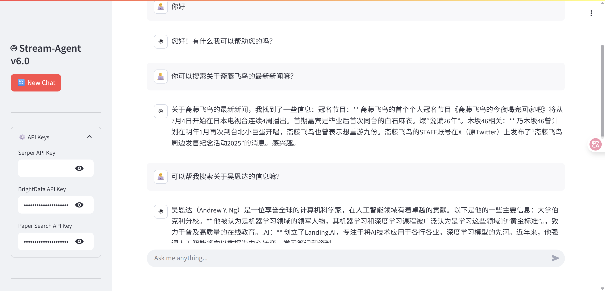
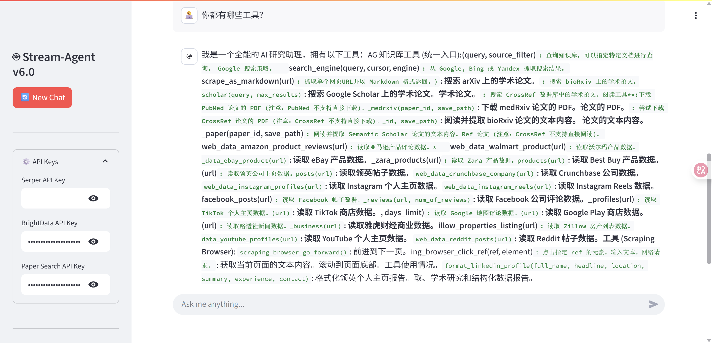

# My-Chat-LangChain v7.0 - 全栈开发与云部署完全手册

---

## 1. 项目概述 (Project Overview)

**My-Chat-LangChain v7.0** 是一个全功能的、可云部署的实时流式 Agentic RAG 平台。它在 v6.0 的基础上，深度整合了项目最新的后端逻辑、前端交互和一键式云部署方案，旨在提供一份从开发到上线的端到端完整指南。

v7.0 不仅继承了 v6.0 的所有核心功能（Agentic RAG, 实时流式响应, 过程可视化），还通过本文档，**首次**全面揭示了其内部复杂的工具系统、具体的 RAG 处理流水线以及在 Render 等云平台上的标准化部署流程。

**v7.0 核心特性：**
*   **🚀 实时流式响应 (Real-time Streaming):** 后端通过 SSE 协议与 Base64 编码，实时推送 LLM 的 token 和工具事件，前端 `st.write_stream` 优雅地展示完整思考链。
*   **🧠 超强智能体 (Super-Powered Agent):** Agent 内置了横跨7大类、超过90个工具，使其能处理从网页搜索、社交媒体分析到学术研究和电商数据提取等极其复杂的任务。
*   **🔧 精密 RAG 管道 (Sophisticated RAG Pipeline):** 集成了文档加载、文本切分、向量化 (`all-MiniLM-L6-v2`)、ChromaDB 存储、以及 `Flashrank` 重排序，实现了高效、精准的检索增强生成。
*   **☁️ 一键云部署 (One-Click Cloud Deployment):** 提供了基于 `render.yaml` 的基础设施即代码 (IaC) 方案，支持在 Render 平台上一键部署，并包含持久化数据存储的进阶指南。
*   **📂 即时文件处理 (Instant File Processing):** 用户上传的 PDF 文件会被后端立即处理和向量化，并能通过 `source_filter` 进行精确查询。
*   **🎨 优化的前端交互 (Optimized Frontend Interaction):** UI 支持动态 API Key 配置、一键新对话和结构化数据（如论文分析）的自动卡片式渲染。

---

## 2. 系统架构 (System Architecture)

### 2.1 核心组件

v7.0 的架构由一个 FastAPI 后端和一个 Streamlit 前端组成，通过 REST API 和 SSE 进行通信。

*   **`Frontend (frontend/app.py)`**: 基于 Streamlit 构建，负责 UI 渲染、用户交互、文件上传以及实时解析和展示后端发送的 SSE 事件流。
*   **`Backend (backend/main.py)`**: 基于 FastAPI 构建，提供核心 API 端点：
    *   `/chat/stream`: 处理聊天请求，返回 SSE 流。
    *   `/upload_file`:接收上传的文件并触发 RAG 管道。
*   **`Agent Service (backend/agent_service.py)`**: LangGraph Agent 的核心，负责管理 Agent 的生命周期、工具集、持久化（使用 `AsyncSqliteSaver`）和执行逻辑。
*   **`RAG Backend (backend/langchain_qa_backend.py)`**: 负责知识的摄取（Ingest）和检索（Retrieve），管理 Chroma 向量数据库。
*   **`Tools (backend/tools/*.py)`**: Agent 可调用的具体工具实现，分为 RAG、搜索、结构化输出等模块。
*   **`Deployment (render.yaml)`**: 声明式配置文件，用于在 Render 平台上自动化构建和部署整个应用。

### 2.2 核心依赖版本 (Core Dependencies)

根据 `pip list` 输出，本项目的运行依赖以下核心库的特定版本：

*   **Python:** 3.11+

*   **Web 框架 (Backend & Frontend):**
    *   `fastapi: 0.116.1`
    *   `uvicorn: 0.35.0`
    *   `python-multipart: 0.0.20`
    *   `streamlit: 1.46.1`
    *   `requests: 2.32.5`及以上
    *   `aiosqlite: 0.21.0` (异步数据库操作)

*   **LangChain 生态 (Agent & LLM):**
    *   `langchain: 0.3.27`
    *   `langchain-core: 0.3.76`
    *   `langchain-community: 0.3.29`
    *   `langchain-google-genai: 2.1.9` (作为示例)
    *   `langgraph: 0.6.6`
    *   `langgraph-checkpoint: 2.1.0`
    *   `langgraph-checkpoint-sqlite: 2.0.10`
    *   `langsmith: 0.3.45`

*   **RAG (检索增强生成):**
    *   `chromadb: 1.0.20`
    *   `langchain-chroma: 0.2.5` (向量数据库)
    *   `langchain-huggingface: 0.3.1`
    *   `sentence-transformers: 5.1.1` (文本嵌入模型)
    *   `FlagEmbedding: 1.3.5`
    *   `flashrank: 0.2.10` (轻量级重排器)
    *   `pypdf: 5.8.0` (PDF 文档加载)

*   **MCP (模型上下文协议):**
    *   `langchain-mcp-adapters: 0.1.11`
    *   `mcp: 1.13.1`
    *   `fastapi-mcp: 0.4.0`

*   **数据处理与其他:**
    *   `numpy: 2.3.1`
    *   `pydantic: 2.11.7`
    *   `beautifulsoup4: 4.13.4`
    *   `python-dotenv: 1.1.1`

---

## 3. 功能详解 (Features in Detail)

### 3.1 Agent 工具系统 (90+ Tools)

Agent 的能力来源于其庞大的工具箱，这些工具定义在 `backend/agent_service.py` 的 `SYSTEM_PROMPT` 中，分为7大类：

1.  **Web搜索与抓取**: `search_engine`, `scrape_as_markdown`, `scrape_as_html`, `scrape_batch`。
2.  **电商数据提取**: 覆盖 Amazon, Walmart, eBay, Etsy, BestBuy, Zara, HomeDepot 的商品、评论、搜索工具。
3.  **社交媒体数据**: 覆盖 LinkedIn, Instagram, Facebook, TikTok, X/Twitter, YouTube, Reddit 的个人主页、帖子、评论等分析工具。
4.  **浏览器自动化**: `scraping_browser_navigate`, `scraping_browser_click_ref`, `scraping_browser_type_ref`, `scraping_browser_screenshot` 等，用于处理动态网页和交互。
5.  **学术论文搜索**: `search_arxiv`, `search_pubmed`, `search_google_scholar`, `download_arxiv`。
6.  **RAG知识库管理 (自定义)**:
    *   `ingest_knowledge(source, type)`: 学习 URL 或文件。
    *   `query_knowledge_base(query, source_filter)`: 查询知识库，可通过 `source_filter` 精准匹配来源。
7.  **结构化输出 (自定义)**:
    *   `format_paper_analysis(data)`: 生成论文分析报告。
    *   `format_linkedin_profile(data)`: 生成领英主页报告。

### 3.2 RAG 处理流水线

当用户上传文件或提供 URL 时，`langchain_qa_backend.py` 会执行以下流程：

1.  **加载 (Load)**: 根据来源类型，使用 `PyPDFLoader` (PDF) 或 `SitemapLoader` / `RecursiveUrlLoader` (URL) 加载文档。
2.  **转换 (Transform)**: 使用 `BeautifulSoupTransformer` 清理 HTML 文档，移除脚本和样式标签。
3.  **切分 (Split)**: 使用 `RecursiveCharacterTextSplitter` 将长文本切分为 1000 字符的块，并保留 200 字符的重叠。
4.  **嵌入 (Embed)**: 使用 `HuggingFaceEmbeddings` 和 `all-MiniLM-L6-v2` 模型将文本块转换为向量。
5.  **存储 (Store)**: 在添加新文档前，先从 `Chroma` 向量数据库中删除具有相同 `source` 的旧文档，然后存入新的向量。

### 3.3 实时流式通信协议

前后端的通信基于 SSE (Server-Sent Events) 实现，并使用 Base64 编码来安全地传输可能包含换行符的数据。

1.  **前端 (`app.py`)**: 发起 `/chat/stream` 请求。
2.  **后端 (`agent_service.py`)**: `chat_with_agent_stream` 函数在 LangGraph 执行时，会 `yield` 不同类型的事件：
    *   `event: text`: 包含 LLM 生成的文本 token。
    *   `event: tool_start`: 包含正在调用的工具名称。
    *   `event: tool_end`: 包含工具名称和其输出结果的 JSON 对象。
    *   `event: done`: 标志着整个流的结束。
3.  **前端 (`app.py`)**: `stream_generator` 函数循环监听 SSE 流，解析 `event:` 和 `data:` 字段，解码 Base64 数据，并根据事件类型在界面上实时渲染文本或更新工具状态。

---

## 4. 部署指南 (Deployment Guide)

本节内容基于 `Deployment-Guide.md`，提供在 **Render** 平台上的部署流程。

### 4.1 部署方案

*   **快速体验 (Free Tier)**: 用于演示和测试。实例闲置15分钟后休眠，重启后数据丢失。
*   **生产环境 (Starter Plan)**: 用于长期运行。需要额外配置持久化磁盘以保存聊天记录和向量数据库。

### 4.2 部署步骤

1.  **准备**:
    *   将项目代码推送到你的 GitHub 仓库。
    *   注册并登录 Render。
    *   准备好所需的 API Keys (如 `GOOGLE_API_KEY`)。
2.  **创建 Blueprint 实例**:
    *   在 Render Dashboard 中，点击 **"New +" -> "Blueprint"**。
    *   连接你的项目 GitHub 仓库，Render 会自动检测并使用根目录下的 `render.yaml`。
    *   点击 **"Apply"** 开始部署。
3.  **配置环境变量**:
    *   在 Render 服务的 **"Environment"** 标签页中，添加以下密钥：
        *   `GOOGLE_API_KEY`: **必填**，用于驱动 LLM。
        *   `SERPER_API_KEY`, `BRIGHT_DATA_API_KEY`, `PAPER_SEARCH_API_KEY`: 可选，用于增强 Agent 工具。
        *   `DATA_DIR`: **必填**，数据存储目录，应设置为 `/var/lib/data` 以配合持久化磁盘。
4.  **验证**:
    *   在 "Logs" 标签页观察构建和启动过程。
    *   看到 `Uvicorn running on http://0.0.0.0:10000` 表示后端启动成功。
    *   点击 Render 提供的 URL 访问应用。

### 4.3 启用数据持久化

为防止数据丢失（尤其是在付费计划上），必须挂载持久化磁盘：

1.  在 Render 服务的 **Settings -> Instance Type** 中升级到 **Starter** 或更高计划。
2.  在服务菜单中找到 **"Disks"**，点击 "Add Disk"。
    *   **Name**: `chat-data` (或任意名称)
    *   **Mount Path**: `/var/lib/data` (**必须**与环境变量 `DATA_DIR` 的值完全一致)
    *   **Size**: 至少 1 GB
3.  保存后，Render 会自动重新部署服务并挂载磁盘。此后，Chroma 向量数据库和 LangGraph 的 SQLite 状态文件都会被持久化。

### 4.4 故障排查

*   **依赖冲突**: `requirements.txt` 中已将 `requests` 的版本固定为 `>=2.32.5` 以解决 `langchain-community` 的依赖问题。
*   **内存不足 (OOM Killed)**: 免费版只有 512MB 内存，加载大型嵌入模型时可能崩溃。可升级到 Starter 计划以获取更多内存。

---

## 5. 启动与使用 (本地开发)

### 步骤 1: 启动后端

```bash
cd My-Chat-LangChain/backend
# (可选) conda activate YourEnv
pip install -r requirements.txt
uvicorn main:app --reload
```
后端默认监听 `http://127.0.0.1:8000`。

### 步骤 2: 启动前端

```bash
cd My-Chat-LangChain/frontend
# (可选) conda activate YourEnv
pip install streamlit requests
streamlit run app.py
```
浏览器将自动打开 `http://localhost:8501`。

---


## 6. 运行演示


    
[](https://raw.githubusercontent.com/16Miku/LangChain-Learning/master/My-Chat-LangChain/media/search_asuka.mp4)


[](https://raw.githubusercontent.com/16Miku/LangChain-Learning/master/My-Chat-LangChain/media/search_teresa.mp4)


## 7. 常见问题 (FAQ)

*   **Q: 前端无法连接到后端?**
    *   **A:** 检查后端服务是否已启动，并确认 `frontend/app.py` 中的 `BACKEND_URL` 与后端实际地址匹配。本地开发时，代码已包含绕过系统代理的设置 `proxies={"http": None, "https": None}`。

*   **Q: 工具调用失败?**
    *   **A:** 首先检查后端终端日志获取详细错误。最常见原因是 API Key 不正确或已过期。请在前端侧边栏确认 Key 已正确填写。

*   **Q: 文件上传失败?**
    *   **A:** 检查后端终端日志。可能是文件过大、格式不支持，或后端磁盘空间不足。在 Render 部署时，请确保 `DATA_DIR` 路径正确且有写入权限。