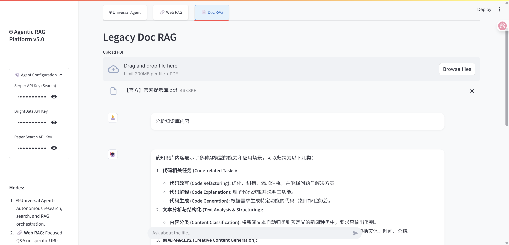
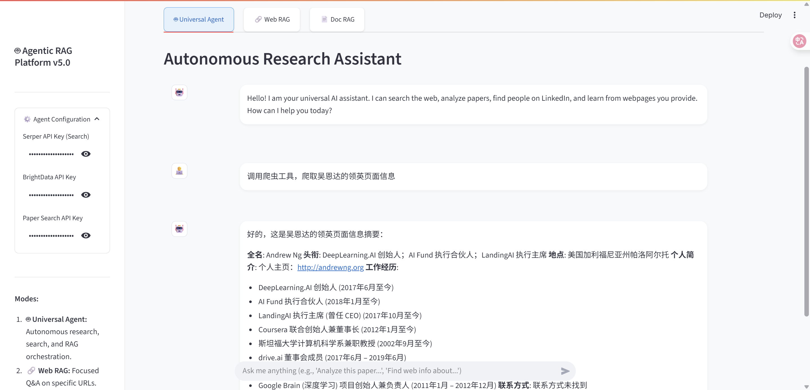
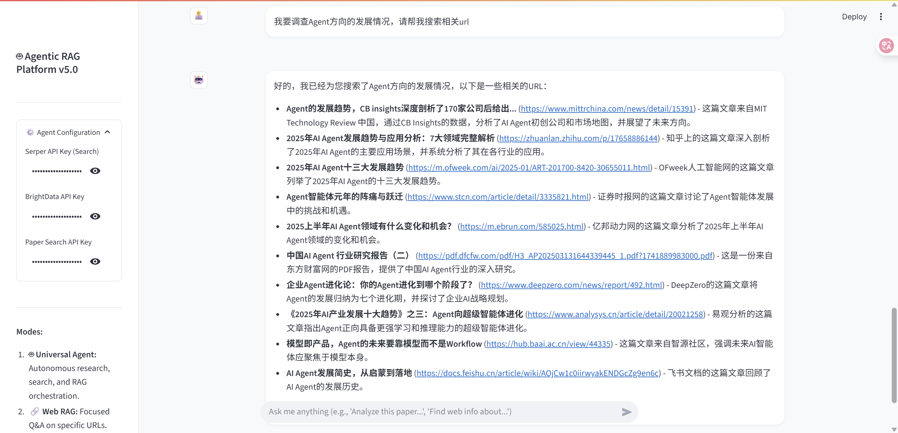
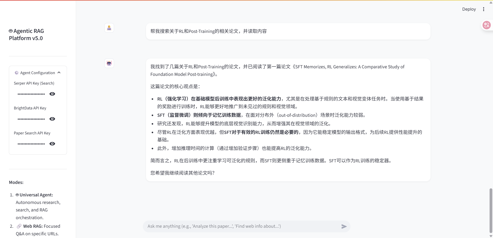
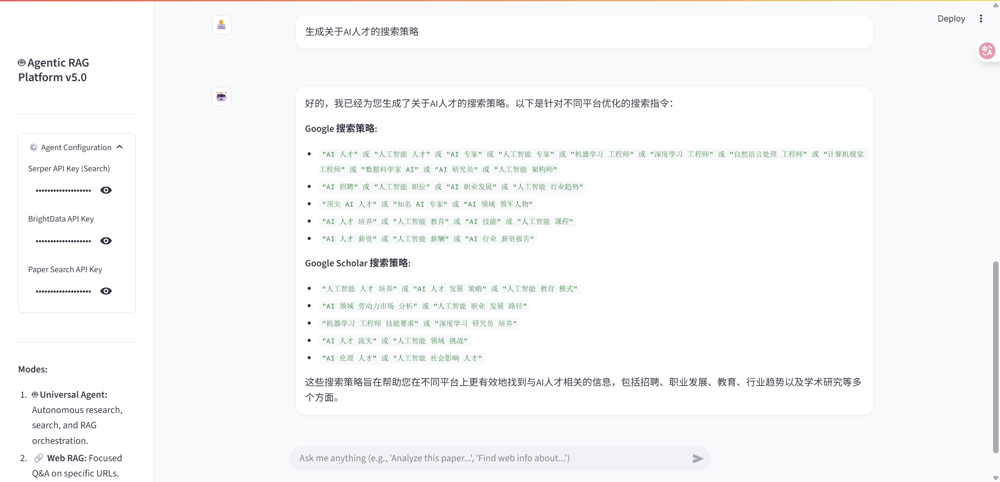

# My-Chat-LangChain v5.0 - Agentic RAG 平台完全开发手册

---

## 1. 项目概述 (Project Overview)

**My-Chat-LangChain v5.0** 是该项目的一个里程碑式升级，标志着它从一个被动的“问答工具”进化为一个主动的、具备自主决策能力的 **Agentic RAG (智能体检索增强生成) 平台**。

在 v5.0 中，我们引入了 **LangGraph** 框架来构建智能体 (Agent) 的“大脑”，并集成了 **MCP (Model Context Protocol)** 协议以连接外部强大的数据服务（如 BrightData 和 PaperSearch）。现在的系统不仅能回答你的问题，还能自主规划任务、上网搜索最新信息、爬取网页数据、阅读论文，并将杂乱的信息整理成结构化的报告。

**核心特性：**
*   **🤖 Universal Agent (通用智能体):** 基于 ReAct (Reasoning + Acting) 模式，具备多轮对话、记忆保持和工具调用能力。
*   **🔌 MCP 生态集成:** 通过 Model Context Protocol 连接外部专业服务，赋予 Agent 真实世界的感知能力（搜索、爬虫）。
*   **📚 RAG 工具化:** 将 v4.0 的 RAG 能力封装为 Agent 的标准工具 (`ingest_knowledge`, `query_knowledge`)，实现“按需学习”。
*   **🧩 结构化输出:** Agent 能够按照预定义的 Schema（如论文分析、简历）输出结构化数据，前端自动渲染为精美卡片。
*   **⚙️ 动态配置:** 支持在前端界面动态配置 API Keys，无需频繁修改环境变量。

---

## 2. 系统架构 (System Architecture)

### 2.1 架构图 (Text Representation)

为了确保在所有环境下都能清晰查看，以下采用文本可视化方式展示架构：

```text
[ 用户 (Browser) ]
       |
       v
[ Streamlit 前端 (Frontend) ]
       |
       +---(HTTP/JSON)---> [ FastAPI 后端 (Backend) ]
                                  |
                                  +--> [ Agent 服务 (LangGraph) ]
                                  |       |
                                  |       +-- 🧠 思考 (Gemini 2.5 Flash)
                                  |       |
                                  |       +-- 🛠️ 工具箱 (Toolbox)
                                  |             |-- 🔍 搜索工具 (Serper)
                                  |             |-- 🕷️ MCP 工具 (BrightData/PaperSearch)
                                  |             |-- 📚 RAG 工具 (Ingest/Query)
                                  |             |      |
                                  |             |      +--> [ 向量数据库 (ChromaDB) ]
                                  |             |      +--> [ 重排器 (FlashRank) ]
                                  |             |
                                  |             +-- 📝 结构化输出 (Schema)
                                  |
                                  +--> [ 旧版 RAG 接口 (Legacy) ]
```

### 2.2 核心组件版本

*   **Python:** 3.10+
*   **LLM:** `langchain-google-genai` (v2.0.4+)
*   **Agent:** `langgraph` (v0.2.53+)
*   **MCP:** `langchain-mcp-adapters` (v0.1.0+)
*   **Vector DB:** `langchain-chroma` (v0.1.4+)
*   **Embedding:** `langchain-huggingface` (v0.1.2+)
*   **Backend:** `fastapi` (v0.115.4+), `uvicorn` (v0.32.0+)
*   **Frontend:** `streamlit` (v1.40.0+)

---

## 3. 目录结构 (Directory Structure)

```
My-Chat-LangChain/
├── backend/                        # 后端服务目录
│   ├── .env                        # 环境变量配置 (Google API Key 等)
│   ├── main.py                     # FastAPI 入口文件 (API 路由定义)
│   ├── agent_service.py            # [v5.0] Agent 核心逻辑与初始化
│   ├── langchain_qa_backend.py     # RAG 核心处理逻辑 (加载、分割、存储、链构建)
│   ├── tools/                      # [v5.0] Agent 工具包
│   │   ├── __init__.py
│   │   ├── rag_tools.py            # RAG 能力封装工具 (ingest/query)
│   │   ├── search_tools.py         # 搜索能力封装工具 (Serper/Gemini)
│   │   └── structure_tools.py      # 结构化输出定义 (Pydantic Models)
│   ├── chroma_db_*/                # 自动生成的向量数据库文件夹
│   └── ...
├── frontend/                       # 前端应用目录
│   ├── app.py                      # Streamlit 入口文件 (UI 布局与交互)
│   ├── style.css                   # 自定义 CSS 样式
│   └── ...
├── Note/                           # 开发文档与笔记
│   ├── Agent-Demo.md               # 参考 Demo 代码
│   ├── Note-V5.md                  # 本说明文档
│   └── ...
└── ...
```

---

## 4. 环境安装与配置 (Installation & Setup)

### 4.1 前置要求
*   Python 3.10 或更高版本
*   Anaconda 或 Miniconda (推荐)
*   Google Gemini API Key (必须)
*   (可选) Serper API Key (搜索功能需要)
*   (可选) BrightData / PaperSearch API Key (MCP 高级功能需要)

### 4.2 后端环境配置

1.  **创建并激活虚拟环境:**
    ```powershell
    conda create -n Gemini python=3.11
    conda activate Gemini
    ```

2.  **安装依赖:**
    进入 `backend` 目录，执行以下命令安装所有必需的库（基于最新版本验证）：
    ```powershell
    cd backend
    pip install fastapi "uvicorn[standard]" python-dotenv
    pip install langchain langchain-community langchain-core langchain-google-genai
    pip install langgraph langchain-mcp-adapters nest_asyncio
    pip install langchain-huggingface sentence-transformers langchain-chroma
    pip install beautifulsoup4 tqdm FlagEmbedding flashrank numpy pypdf
    ```

3.  **配置环境变量:**
    在 `backend` 目录下创建 `.env` 文件，填入您的 Google API Key。
    ```env
    GOOGLE_API_KEY=your_google_api_key_here
    # SERPER_API_KEY=your_serper_key_here (可选，建议在前端动态输入)
    ```

### 4.3 前端环境配置

1.  **安装 Streamlit:**
    ```powershell
    cd frontend
    pip install streamlit requests
    ```

---

## 5. 核心代码详解 (Code Explanation)

### 5.1 `backend/agent_service.py` (Agent 大脑)

这是 v5.0 的心脏。它负责初始化 LangGraph Agent 并装配所有工具。

*   **MCP 客户端:** 使用 `MultiServerMCPClient` 连接 BrightData 和 PaperSearch。
    *   **关键配置:** `transport="streamable_http"`。这是为了兼容大多数网络环境（包括代理）并解决 400 错误的关键设置。
*   **工具装配:** 将自定义工具 (`search_tools`, `rag_tools`, `structure_tools`) 与 MCP 工具合并列表 `all_tools`。
*   **Agent 构建:** 使用 `create_react_agent` 构建 ReAct 风格智能体。
    *   **兼容性处理:** 采用了手动注入 `SystemMessage` 到 `messages` 列表的方式，代替了 `state_modifier` 参数，确保了与不同版本 LangGraph 的最大兼容性。
*   **System Prompt:** 定义了 Agent 的行为准则，指导它何时使用 RAG，何时搜索，以及如何进行结构化输出。

### 5.2 `backend/tools/` (工具箱)

*   **`rag_tools.py`:**
    *   `ingest_knowledge(url)`: 调用 `langchain_qa_backend.py` 中的逻辑，将网页内容爬取、清洗、向量化并存储到 ChromaDB。支持缓存，避免重复处理。
    *   `query_knowledge(query, url)`: 加载对应的 ChromaDB，构建包含重排器 (FlashRank) 的 RAG 链，回答特定问题。
*   **`search_tools.py`:**
    *   `generate_search_queries`: 利用 LLM 生成专业的搜索关键词。
    *   `execute_searches_and_get_urls`: 调用 Serper API 进行 Google 搜索，返回高质量 URL 列表。
*   **`structure_tools.py`:**
    *   定义了 `format_paper_analysis` 和 `format_linkedin_profile` 工具。这些工具本身不执行复杂逻辑，而是作为 Agent 的“输出模版”，强制 Agent 将非结构化文本整理为标准的 JSON 格式，供前端渲染。

### 5.3 `frontend/app.py` (交互界面)

*   **Tab 布局:** 新增了 "🤖 Universal Agent" 标签页。
*   **动态配置:** 侧边栏增加了 API Key 输入框，通过 Session State 传递给后端。
*   **富媒体渲染:**
    *   检测后端返回的消息是否为 JSON 格式。
    *   如果是 `paper_analysis` 类型，渲染为论文卡片（标题、作者、摘要等）。
    *   如果是 `linkedin_profile` 类型，渲染为简历卡片。
*   **代理处理:** 在 `requests.post` 中显式设置 `proxies={"http": None, "https": None}`，防止本地请求被系统代理拦截导致连接失败。

---

## 6. 启动与使用 (Usage Guide)

### 步骤 1: 启动后端
打开一个终端窗口：
```powershell
cd My-Chat-LangChain/backend
# 激活您的虚拟环境
uvicorn main:app --reload
```
*看到 `Application startup complete` 即表示后端启动成功。*

### 步骤 2: 启动前端
打开另一个终端窗口：
```powershell
cd My-Chat-LangChain/frontend
# 激活您的虚拟环境
streamlit run app.py
```
浏览器将自动打开 `http://localhost:8501`。

### 步骤 3: 使用 Universal Agent

1.  在左侧侧边栏 **"Agent Configuration"** 中，填入您的 API Key。
    *   **Serper API Key**: 必填，用于联网搜索。
    *   **BrightData / PaperSearch**: 选填，用于增强爬虫和论文搜索能力。
2.  切换到 **"🤖 Universal Agent"** 标签页。
3.  **场景示例**:
    

- 上传本地PDF文件作为知识库：




- 调用BrightData的专业爬虫工具：




- 调用BrightData的专业搜索工具：





- 调用PaperSearch的专业论文搜索和读取工具：




- 调用自定义Tool：




---

## 7. 常见问题与排错 (Troubleshooting)


*   **Q: MCP 连接显示 `400 Bad Request`?**
    *   **A:** 这通常是因为传输协议不匹配。v5.0 已将 MCP 客户端的 `transport` 强制设置为 `streamable_http`，这解决了该问题。请确保您没有手动改回 `sse`。

*   **Q: 前端提示 `Backend Error` 或一直旋转?**
    *   **A:**
        1.  检查后端终端是否有报错信息。
        2.  确认前端 `app.py` 中是否保留了 `proxies={"http": None...}` 的配置。
        3.  如果后端正在进行繁重的 RAG 索引任务（创建向量库），首次响应可能会超过 3 分钟，请耐心等待或检查后端日志进度条。

*   **Q: 终端出现 `WARNING - Failed to validate notification`?**
    *   **A:** 这是 MCP 协议库的已知无害警告，表示服务端推送的消息格式与本地校验规则有轻微差异。不影响功能，可忽略。

