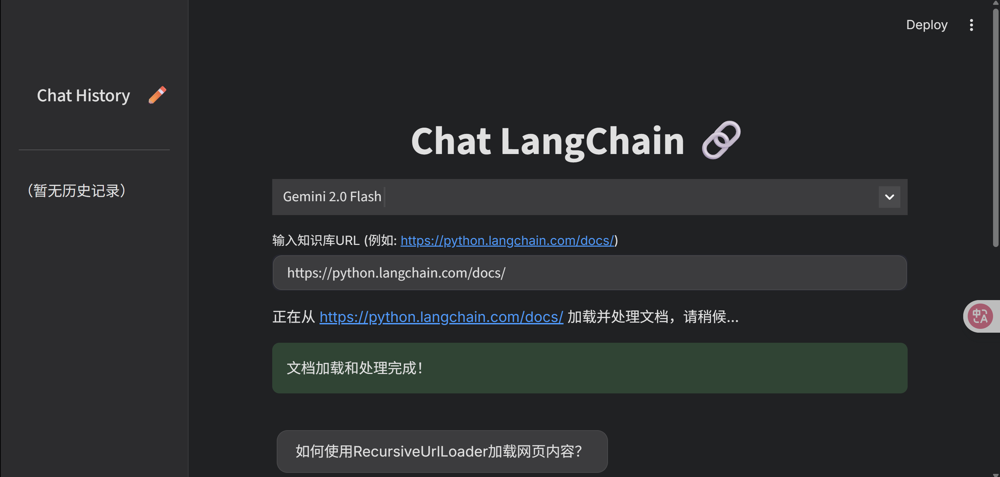
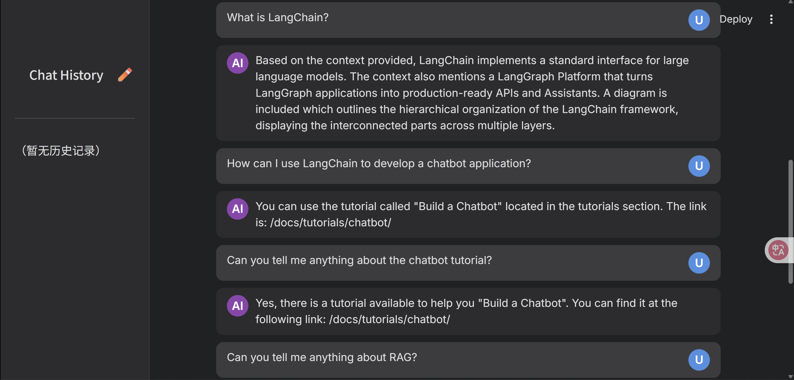

# My-Chat-LangChain

## LangChain 问答机器人应用说明书 v1.0

### 1. 应用概述

本应用是一个基于 LangChain 框架和 Streamlit 构建的问答机器人系统。它允许用户指定一个网页 URL 作为知识库来源，然后通过自然语言提问，机器人将根据该网页及其子链接的内容提供回答。应用前端界面采用 Streamlit 构建，并进行了自定义样式以提供美观的用户体验。

**核心功能：**

*   **网页内容加载：** 能够从指定 URL 递归加载网页内容作为知识库。
*   **RAG (Retrieval-Augmented Generation) 问答：** 结合检索增强生成技术，利用大语言模型 (LLM) 和加载的知识库进行问答。
*   **Streamlit 用户界面：** 提供直观的 Web 界面进行交互，包括聊天历史显示、问题输入和预设问题按钮。
*   **API 密钥管理：** 支持通过 Streamlit Secrets 安全地配置 Google Gemini API 密钥。

### 2. 技术栈

*   **前端框架：** Streamlit
*   **后端框架：** LangChain
*   **大语言模型 (LLM)：** Google Gemini (具体为 `gemini-1.5-flash` 或 `gemini-2.0-flash`，取决于 `langchain_qa_backend.py` 中的配置)
*   **嵌入模型：** Google Generative AI Embeddings (`models/embedding-001`)
*   **向量存储：** InMemoryVectorStore (内存向量存储)
*   **文档加载：** `langchain_community.document_loaders.RecursiveUrlLoader`
*   **文本分割：** `langchain.text_splitter.RecursiveCharacterTextSplitter`

### 3. 环境准备

在运行此应用之前，请确保您的系统满足以下要求并安装了必要的依赖。

*   **操作系统：** Windows 11 (默认运行环境，但理论上兼容其他操作系统)
*   **Python 版本：** Python 3.9 或更高版本
*   **包管理器：** pip

**安装依赖库：**

打开 PowerShell 命令行，执行以下命令安装所有必需的 Python 库：

```powershell
pip install streamlit langchain langchain-community langchain-google-genai  beautifulsoup4
```

### 4. 安装与配置

1.  **项目结构：**
    请确保你的项目目录结构如下：

    ```
    your_project_folder/
    ├── app.py
    ├── langchain_qa_backend.py
    └── .streamlit/
        └── secrets.toml
    ```

2.  **获取 Google Gemini API 密钥：**
    你需要一个 Google Gemini API 密钥才能使用 Google 的大语言模型和嵌入模型。请访问 Google AI Studio 或 Google Cloud Platform 获取你的 API 密钥。

3.  **配置 API 密钥：**
    为了安全地管理 API 密钥，本应用使用 Streamlit 的 `secrets` 功能。
    *   在你的项目根目录下创建一个名为 `.streamlit` 的文件夹（如果不存在）。
    *   在该 `.streamlit` 文件夹内创建一个名为 `secrets.toml` 的文件。
    *   打开 `secrets.toml` 文件，并添加以下内容，将 `YOUR_YOUR_GOOGLE_API_KEY_HERE` 替换为你的实际 Google Gemini API 密钥：

        ```toml
        # .streamlit/secrets.toml
        GOOGLE_API_KEY = "YOUR_YOUR_GOOGLE_API_KEY_HERE"
        ```

### 5. 使用方法

1.  **启动应用：**
    打开 PowerShell 命令行，导航到你的项目根目录（即 `app.py` 和 `langchain_qa_backend.py` 所在的目录），然后运行以下命令：

    ```powershell
    streamlit run app.py
    ```
    成功启动后，Streamlit 会在你的默认 Web 浏览器中自动打开一个新的标签页，显示问答机器人应用（通常地址为 `http://localhost:8501`）。

2.  **指定知识库 URL：**
    在应用界面的顶部，你会看到一个文本输入框，标题为“输入知识库URL”。
    *   在输入框中输入你希望机器人学习和回答问题的网页 URL。例如：`https://python.langchain.com/docs/`。
    *   首次输入或更改 URL 后，应用会自动开始加载和处理该网页及其子链接的内容，这可能需要一些时间，界面上会显示“正在从 [URL] 加载并处理文档，请稍候...”的提示。
    *   加载完成后，会显示“文档加载和处理完成！”的提示。

3.  **提问：**
    知识库加载完成后，你可以在底部的“How can I...”输入框中输入你的问题。
    *   输入问题后，点击输入框右侧的“▶️”发送按钮。
    *   机器人会根据加载的知识库内容进行思考，并在聊天区域显示其回答。

4.  **使用预设问题：**
    在输入框上方，提供了几个预设问题按钮。你可以直接点击这些按钮，机器人将自动发送该问题并提供回答。

5.  **聊天历史：**
    应用主界面会显示用户和机器人的对话历史。






### 6. 核心代码模块说明

#### `langchain_qa_backend.py`

这个文件包含了问答机器人的核心逻辑，包括文档加载、文本分割、嵌入、向量存储和问答链的构建。

*   **`load_and_process_documents(url: str)` 函数：**
    *   使用 `RecursiveUrlLoader` 从指定的 URL 加载网页文档。
    *   `max_depth=1` 参数意味着它只会加载当前 URL 页面，不会递归抓取更深层的子链接。**（注：在提供的代码中，`max_depth` 在 `langchain_qa_backend.py` 中是 `2`，而在 `app.py` 中默认 URL 的提示是 `https://python.langchain.com/docs/`，如果希望加载更多文档，可以调整 `max_depth`，但会增加加载时间。）**
    *   使用 `RecursiveCharacterTextSplitter` 将加载的文档分割成更小的块，以便于嵌入和检索。
    *   使用 `GoogleGenerativeAIEmbeddings` 生成文本块的嵌入向量。
    *   将嵌入向量存储在 `InMemoryVectorStore` 中。
    *   创建并返回一个 `VectorStoreRetriever` 实例，用于从向量存储中检索相关文档。
    *   此函数使用 `@st.cache_resource` 装饰器，其结果会被 Streamlit 缓存，避免每次应用刷新时都重新加载和处理文档。

*   **`get_retrieval_chain(_retriever)` 函数：**
    *   使用 `ChatGoogleGenerativeAI` 初始化一个大语言模型实例（`gemini-1.5-flash` 或 `gemini-2.0-flash`）。
    *   从 `langchain-hub` 拉取预设的 `retrieval-qa-chat` 提示模板。
    *   创建 `create_stuff_documents_chain` 将检索到的文档与用户问题结合起来发送给 LLM。
    *   创建 `create_retrieval_chain` 将检索器和文档组合链连接起来，形成完整的 RAG 问答链。
    *   此函数也使用 `@st.cache_resource` 装饰器，其结果会被 Streamlit 缓存。注意参数 `_retriever` 前的下划线是为了解决 Streamlit 缓存 `UnhashableParamError` 的问题。

*   **`answer_question(retrieval_chain, query: str)` 函数：**
    *   接收构建好的 `retrieval_chain` 和用户查询，调用问答链的 `invoke` 方法获取回答。
    *   处理潜在的错误并返回回答或错误信息。

#### `app.py`

这个文件负责构建 Streamlit 用户界面和处理用户交互。

*   **CSS 样式：** 顶部定义了大量的 CSS 样式，用于定制应用的整体主题、颜色、字体、按钮、输入框以及聊天消息的显示，以达到仿照图片界面的效果。
*   **Streamlit 页面配置：** 设置了页面标题、图标和布局。
*   **侧边栏：** 包含“Chat History”标题，为未来的聊天历史管理功能预留了空间。
*   **主内容区：**
    *   显示应用主标题“Chat LangChain”。
    *   提供模型选择下拉框（当前仅显示“Gemini 2.0 Flash”）。
    *   `st.session_state` 用于管理应用的状态，如聊天消息、检索器和问答链实例，确保应用在用户交互过程中保持状态。
    *   URL 输入框用于动态指定知识库来源。当 URL 改变时，会清空缓存并重新加载知识库。
    *   调用 `load_and_process_documents` 和 `get_retrieval_chain` 函数来初始化知识库和问答链。
    *   显示预设问题按钮，点击后触发问答流程。
    *   循环 `st.session_state.messages` 显示聊天历史，并根据消息角色应用不同的 CSS 样式。
    *   底部的表单包含用户输入框和发送按钮，用于用户输入问题。提交问题后，调用 `answer_question` 获取回答并更新聊天历史。

### 7. 当前待改进问题

**问题：应用加载网址及其子链接到 RAG 很慢。**

*   **原因分析：**
    1.  **`RecursiveUrlLoader` 的 `max_depth` 过大：** 在 `langchain_qa_backend.py` 中，`loader = RecursiveUrlLoader(url, max_depth=2)`。`max_depth=2` 意味着它会抓取起始 URL 本身，以及起始 URL 页面上的所有链接指向的页面。如果目标网站包含大量子页面或结构复杂，抓取和处理这些页面会非常耗时。
    2.  **网站抓取速度限制：** 某些网站可能有反爬机制或限制抓取速度，导致加载缓慢。
    3.  **内容量大：** 如果抓取到的页面内容非常多，文本分割和嵌入过程会耗费大量时间。
    4.  **网络延迟：** 抓取远程 URL 依赖于网络连接速度。
    5.  **内存限制：** `InMemoryVectorStore` 将所有嵌入数据存储在内存中，如果知识库过大，可能导致内存不足或性能下降。

*   **优化建议：**
    1.  **调整 `max_depth`：** 除非你确实需要整个网站的内容，否则请减小 `max_depth`。例如，`max_depth=1` 只抓取当前页面，这会显著加快加载速度。在 `langchain_qa_backend.py` 中将 `loader = RecursiveUrlLoader(url, max_depth=2)` 改为 `max_depth=1`。
    2.  **预处理和离线存储：** 对于大型知识库，建议在应用启动前预先抓取、处理并存储到持久化的向量数据库（如 FAISS、ChromaDB、Pinecone 等），而不是每次启动都实时抓取。这样应用启动时只需加载预处理好的向量索引，大大加快速度。
    3.  **并发加载：** 对于抓取多个独立 URL 的场景，可以考虑使用并发技术（如 `asyncio` 或线程池）来加速加载。
    4.  **排除不相关内容：** `RecursiveUrlLoader` 默认会加载页面上的所有文本内容，包括导航、页脚等不相关信息。可以考虑使用 `exclude_dirs` 或 `exclude_url_prefixes` 参数来过滤不必要的 URL，或在加载后对文档内容进行清洗。
    5.  **优化文本分割：** 调整 `chunk_size` 和 `chunk_overlap` 参数，找到最适合你的数据和模型性能的平衡点。

**问题：问答效果不好。**

*   **原因分析：**
    1.  **知识库质量：**
        *   **内容相关性不足：** 抓取到的网页内容可能与用户的问题不直接相关，或者信息过于分散。
        *   **内容噪音：** 网页上存在大量广告、导航、脚本等非核心内容，这些噪音会影响嵌入质量和检索准确性。
        *   **信息密度低：** 页面内容太少，无法提供足够的信息来回答复杂问题。
    2.  **文本分割策略：** `chunk_size=1000, chunk_overlap=200` 可能不适合所有类型的文档。过大的块可能包含太多不相关信息，过小的块可能丢失上下文。
    3.  **嵌入模型能力：** `models/embedding-001` 是一个通用的嵌入模型，可能对某些特定领域的知识效果不佳。
    4.  **检索策略：**
        *   `search_type="mmr"` (最大边际相关性) 结合 `k=1, fetch_k=2, lambda_mult=0.5` 的参数可能不适合所有情况。`k=1` 意味着只检索最相关的1个文档块，这可能不足以提供全面上下文。
        *   如果检索到的文档不准确，LLM 就无法生成好的回答。
    5.  **LLM 能力和 Prompt：**
        *   `gemini-1.5-flash` 或 `gemini-2.0-flash` 是快速模型，但在处理复杂推理或需要更深入理解的场景时，可能不如更强大的模型（如 `gemini-1.5-pro`）。
        *   `langchain-ai/retrieval-qa-chat` 是一个通用 Prompt，可能需要针对你的特定应用场景进行微调或定制。
    6.  **上下文窗口限制：** LLM 的上下文窗口大小有限。如果检索到的相关文档和聊天历史过长，超出模型上下文窗口，部分信息会被截断，导致回答不完整或不准确。

*   **优化建议：**
    1.  **改进知识库质量：**
        *   **选择高质量的源网站：** 优先选择内容结构清晰、信息密度高、噪音少的网站。
        *   **内容清洗：** 在加载文档后，可以添加额外的步骤来清除 HTML 标签、脚本、广告、导航等无关内容，只保留核心文本。可以使用 `BeautifulSoup` 或其他文本处理库。
        *   **分层加载：** 对于复杂网站，可以考虑只抓取特定路径下的文档，或手动指定关键页面的 URL。
    2.  **优化文本分割：**
        *   **实验不同的 `chunk_size` 和 `chunk_overlap`：** 尝试不同的值，找到能最好地保留上下文并避免信息冗余的分割策略。
        *   **基于语义的分割：** 考虑使用更智能的文本分割器，例如根据标题、段落、代码块等语义结构进行分割。
    3.  **增强检索策略：**
        *   **调整 `k` 和 `fetch_k`：** 增加 `k` (实际传递给 LLM 的文档数量) 和 `fetch_k` (从向量库中检索的初始文档数量)，以提供更多上下文。
        *   **多阶段检索：** 实施更复杂的检索流程，例如：
            *   **查询扩展：** 使用 LLM 扩展用户查询，生成多个相关查询进行检索。
            *   **重排器 (Reranking)：** 检索到多个文档后，使用一个独立的模型（如 Cohere Rerank）对这些文档进行重新排序，将最相关的文档排在前面。
        *   **使用更强大的向量数据库：** 内存向量存储适用于小规模测试，但对于生产环境或大规模知识库，持久化、高性能的向量数据库是更好的选择。
    4.  **模型和 Prompt 优化：**
        *   **尝试更强大的 LLM：** 如果预算允许，可以尝试 `gemini-1.5-pro` 或其他更强大的模型。
        *   **Prompt 工程：** 精心设计 Prompt，明确告诉 LLM 它的角色、回答的限制（例如，只根据提供的上下文回答）、回答格式等。可以尝试添加 Few-shot 示例。
        *   **对话历史：** 在 RAG 链中引入对话历史，让 LLM 能够理解多轮对话的上下文。LangChain 提供了 `ConversationalRetrievalChain` 等方便的工具。


