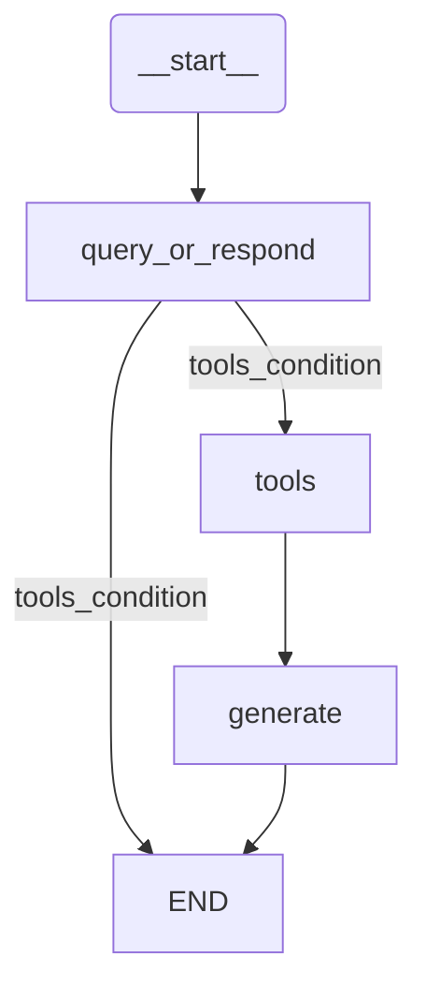
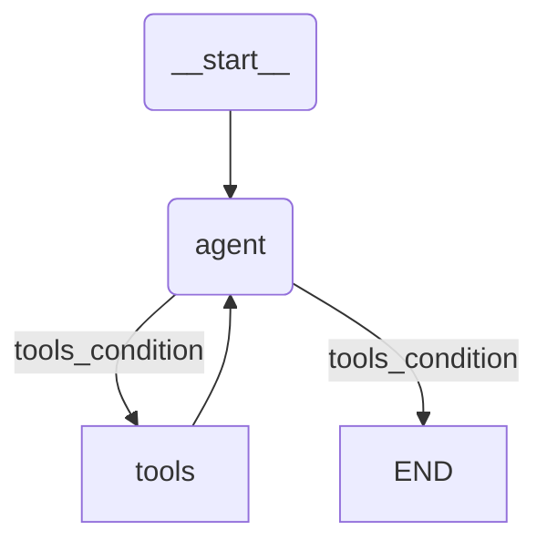

官方文档教程：
https://python.langchain.com/docs/tutorials/qa_chat_history/


好的，作为一名高级软件工程师，我将继续逐步详细讲解并指导您实践RAG应用程序的第二部分。我们将深入探讨如何为RAG应用添加对话记忆和多步检索能力，并对每行代码、每个类、方法和变量进行详尽的解读，确保您能彻底理解。

---

## 构建RAG应用程序：第二部分

在许多问答应用程序中，我们希望用户能够进行来回的对话，这意味着应用程序需要某种“记忆”来记住过去的问答，并具备将这些信息融入当前思考的逻辑。

本教程是多部分教程的第二部分：
*   第一部分介绍了RAG并展示了一个最小实现。
*   第二部分（本指南）将扩展实现，以适应对话式交互和多步检索过程。

在这里，我们将重点放在添加整合历史消息的逻辑上，这涉及到聊天历史的管理。我们将涵盖两种方法：
1.  **链（Chains）**: 最多执行一个检索步骤。
2.  **代理（Agents）**: 赋予LLM自由裁量权，以执行多个检索步骤。

**注意**: 这里介绍的方法利用了现代聊天模型的工具调用能力。

对于外部知识源，我们将继续使用第一部分中Lilian Weng的博客文章“LLM Powered Autonomous Agents”。

### 环境设置 (Setup)

在开始之前，我们需要安装一些必要的库并配置LangSmith（可选，但强烈推荐用于跟踪应用）。

1.  **安装依赖**:
    打开您的PowerShell命令行，然后执行以下pip安装命令。

    ```powershell
    pip install --quiet --upgrade langchain-text-splitters langchain-community langgraph beautifulsoup4 langchain langchain-core
    pip install -qU "langchain[google-genai]"
    pip install -qU langchain-google-genai
    pip install -qU langchain-chroma
    ```
    *   `--quiet` 或 `-q` 参数是为了在安装过程中减少输出信息。
    *   `-U` 参数是为了确保安装的库是最新版本。
    *   我额外添加了 `langchain` 和 `langchain-core`，以确保所有LangChain相关的核心组件都更新到最新，避免潜在的MRO（Method Resolution Order）错误。

2.  **LangSmith 配置 (可选但推荐)**:
    LangSmith 是 LangChain 应用程序的调试、测试、评估和监控平台。它能帮助我们追踪复杂应用中的LLM调用。

    首先，您需要注册 LangSmith 并获取 `LANGSMITH_API_KEY`。
    然后，在您的PowerShell环境中设置环境变量：

    ```powershell
    $env:LANGSMITH_TRACING="true"
    $env:LANGSMITH_API_KEY="YOUR_LANGSMITH_API_KEY"
    ```
    **请将 `YOUR_LANGSMITH_API_KEY` 替换为您自己的LangSmith API Key。**

    或者，如果您在Jupyter Notebook中运行，可以使用Python代码设置：

    ```python
    import getpass
    import os

    os.environ["LANGSMITH_TRACING"] = "true"
    # 如果您已经在PowerShell中设置了LANGSMITH_API_KEY，这里可以省略，
    # 否则，您可以通过getpass输入或直接赋值
    if not os.environ.get("LANGSMITH_API_KEY"):
        os.environ["LANGSMITH_API_KEY"] = getpass.getpass("Enter your LangSmith API Key: ")
    print("LangSmith 跟踪已启用。")
    ```

3.  **组件选择**:
    我们将从LangChain的集成套件中选择三个核心组件：

    *   **选择聊天模型 (Chat Model)**:
        我们将使用Google Gemini模型。您需要一个Google Gemini API Key。

        ```python
        import getpass
        import os
        from langchain.chat_models import init_chat_model

        # 确保GOOGLE_API_KEY环境变量已设置
        if not os.environ.get("GOOGLE_API_KEY"):
            os.environ["GOOGLE_API_KEY"] = getpass.getpass("Enter API key for Google Gemini: ")

        # 初始化聊天模型。 "gemini-2.5-flash"是模型名称，model_provider指定提供者。
        llm = init_chat_model("gemini-2.5-flash", model_provider="google_genai")
        print("聊天模型 (LLM) 已初始化。")
        ```

    *   **选择嵌入模型 (Embeddings Model)**:
        我们将使用Google Generative AI Embeddings。

        ```python
        import getpass
        import os
        from langchain_google_genai import GoogleGenerativeAIEmbeddings

        # 确保GOOGLE_API_KEY环境变量已设置
        if not os.environ.get("GOOGLE_API_KEY"):
            os.environ["GOOGLE_API_KEY"] = getpass.getpass("Enter API key for Google Gemini: ")

        # 初始化嵌入模型。 "models/gemini-embedding-001"是嵌入模型的名称。
        embeddings = GoogleGenerativeAIEmbeddings(model="models/gemini-embedding-001")
        print("嵌入模型 (Embeddings Model) 已初始化。")
        ```

    *   **选择向量存储 (Vector Store)**:
        我们将使用Chroma作为向量存储，它是一个轻量级的本地向量数据库。

        ```python
        from langchain_chroma import Chroma

        # 初始化向量存储
        # collection_name: 存储文档的集合名称，用于区分不同的数据集。
        # embedding_function: 指定用于生成文档嵌入的函数，这里使用我们之前初始化的embeddings模型。
        # persist_directory: 指定数据本地保存的路径。如果不需要持久化（例如每次运行都重新生成），可以移除此参数。
        vector_store = Chroma(
            collection_name="example_collection",
            embedding_function=embeddings,
            persist_directory="./chroma_langchain_db",
        )
        print("向量存储 (Vector Store) 已初始化。")
        ```

### 链 (Chains)

首先，让我们重新审视第一部分中构建的向量存储，它索引了Lilian Weng的博客文章“LLM Powered Autonomous Agents”。

```python
import bs4 # 用于HTML解析
from langchain import hub # 用于从LangChain Hub拉取提示模板
from langchain_community.document_loaders import WebBaseLoader # 用于从网页加载文档
from langchain_core.documents import Document # LangChain文档的基本数据结构
from langchain_text_splitters import RecursiveCharacterTextSplitter # 用于递归文本分割
from typing_extensions import List, TypedDict # 用于类型提示

# --- 1. 索引阶段：加载并分块博客内容 ---
print("开始加载文档...")
loader = WebBaseLoader(
    web_paths=("https://lilianweng.github.io/posts/2023-06-23-agent/",), # 指定要加载的网页URL
    bs_kwargs=dict( # 传递给BeautifulSoup解析器的关键字参数
        parse_only=bs4.SoupStrainer( # BeautifulSoup的过滤器，只解析指定class的HTML标签
            class_=("post-content", "post-title", "post-header") # 仅保留文章内容、标题和头部
        )
    ),
)
docs = loader.load() # 加载文档，返回Document对象列表
print(f"文档加载完成，共 {len(docs)} 篇文档。")

print("开始分割文档...")
text_splitter = RecursiveCharacterTextSplitter(
    chunk_size=1000, # 每个文本块的最大字符数
    chunk_overlap=200 # 文本块之间的重叠字符数，有助于保持上下文
)
all_splits = text_splitter.split_documents(docs) # 分割文档，返回更小的Document对象列表
print(f"文档分割完成，共 {len(all_splits)} 个文本块。")

# --- 2. 索引文本块到向量存储 ---
print("开始索引文本块到向量存储...")
# 将所有分割后的文档添加到向量存储中。`_` 表示我们不关心返回的文档ID。
_ = vector_store.add_documents(documents=all_splits)
print("文本块索引完成。")
```
这段代码与第一部分中的索引部分完全相同，它确保我们的向量存储是最新的，包含了博客文章的嵌入式文本块。

在RAG教程的第一部分中，我们将用户输入、检索到的上下文和生成的答案表示为状态中的独立键。对话体验可以用一系列消息自然地表示。除了来自用户和助手的消息外，检索到的文档和其他工件可以通过工具消息（Tool Messages）合并到消息序列中。这促使我们使用消息序列来表示RAG应用程序的状态。具体来说，我们将有：
*   用户输入作为 `HumanMessage`；
*   向量存储查询作为带有工具调用的 `AIMessage`；
*   检索到的文档作为 `ToolMessage`；
*   最终响应作为 `AIMessage`。

LangGraph提供了一个内置的 `MessagesState`，以方便这种状态模型：

```python
from langgraph.graph import MessagesState, StateGraph

# StateGraph 是 LangGraph 中用于定义图的基类。
# MessagesState 是 LangGraph 提供的一个特殊的状态类型，它将所有消息存储在一个列表中。
# 每次更新状态时，新消息都会被追加到 'messages' 列表中，而不是覆盖现有状态。
graph_builder = StateGraph(MessagesState)
print("LangGraph 的 MessagesState 已初始化。")
```
`MessagesState` 的使用极大地简化了对话历史的管理，因为它自动处理消息的追加，使我们能够轻松地构建具有记忆的对话应用程序。

利用工具调用与检索步骤进行交互还有另一个好处，即检索的查询是由我们的模型生成的。这在对话设置中尤其重要，因为用户查询可能需要根据聊天历史进行上下文化。例如，考虑以下对话：

*   **Human**: "什么是任务分解？"
*   **AI**: "任务分解涉及将复杂任务分解为更小、更简单的步骤，使其更易于代理或模型管理。"
*   **Human**: "有哪些常见方法？"

在这种情况下，模型可以生成一个查询，例如“任务分解的常见方法”。工具调用自然地促进了这一点。正如RAG教程的查询分析部分一样，这允许模型将用户查询重写为更有效的搜索查询。它还支持不涉及检索步骤的直接响应（例如，响应用户的通用问候）。

现在，让我们将检索步骤转换为一个工具：

```python
from langchain_core.tools import tool # 导入 tool 装饰器，用于将函数转换为工具

@tool(response_format="content_and_artifact") # 使用 @tool 装饰器将 retrieve 函数注册为一个工具
def retrieve(query: str):
    """
    检索工具：根据查询从向量存储中检索相关信息。
    此工具被设计为由LLM调用，用于执行信息检索。

    Args:
        query (str): 用于搜索向量存储的查询字符串。

    Returns:
        tuple[str, List[Document]]:
            - str: 序列化后的文档内容，用于LLM生成答案。
            - List[Document]: 原始的检索到的文档对象列表，作为工件存储在状态中。
    """
    print(f"--- 正在执行工具: retrieve, 查询: '{query}' ---")
    # 从向量存储中执行相似性搜索，k=2表示检索最相似的2个文档。
    retrieved_docs = vector_store.similarity_search(query, k=2)
    # 将检索到的文档内容格式化为字符串，每个文档包含其元数据和内容。
    serialized = "\n\n".join(
        (f"Source: {doc.metadata}\nContent: {doc.page_content}")
        for doc in retrieved_docs
    )
    print(f"--- 工具 'retrieve' 执行完成，检索到 {len(retrieved_docs)} 篇文档 ---")
    # 返回序列化内容和原始文档列表。
    # response_format="content_and_artifact" 允许工具返回两个值：
    # 第一个值 (serialized) 作为 ToolMessage 的内容，
    # 第二个值 (retrieved_docs) 作为 ToolMessage 的附加工件 (artifact) 存储。
    return serialized, retrieved_docs

print("检索工具 'retrieve' 已定义。")
```
**`@tool(response_format="content_and_artifact")` 详解：**
*   `@tool` 装饰器：这是LangChain提供的一种将普通Python函数转换为可被LLM调用的“工具”的方式。当LLM被赋予使用工具的能力时，它可以通过生成一个特殊的“工具调用”来调用这些函数。
*   `response_format="content_and_artifact"`：这个参数告诉LangGraph（或LangChain的工具调用机制）如何处理工具的返回值。
    *   `content`：工具返回的第一个值（这里是 `serialized` 字符串）将被用作 `ToolMessage` 的主要内容。LLM在后续生成答案时会直接看到这个内容。
    *   `artifact`：工具返回的第二个值（这里是 `retrieved_docs` 列表）将被存储在 `ToolMessage` 的 `additional_kwargs` 字段中。这允许我们保留原始的文档对象，以便在需要时进行进一步处理或调试，而LLM的上下文不会被这些原始对象占用。

我们的图将由三个节点组成：
1.  **`query_or_respond` 节点**: 处理用户输入，要么生成一个用于检索器的查询，要么直接响应。
2.  **`tools` 节点**: 执行检索工具。
3.  **`generate` 节点**: 使用检索到的上下文生成最终响应。

我们将在下面构建它们。请注意，我们利用了另一个预构建的LangGraph组件 `ToolNode`，它执行工具并将结果作为 `ToolMessage` 添加到状态中。

```python
from langchain_core.messages import SystemMessage, HumanMessage, AIMessage, ToolMessage # 导入不同类型的消息
from langgraph.prebuilt import ToolNode # 导入 LangGraph 的预构建 ToolNode

# --- 节点 1: query_or_respond ---
# 这个节点负责接收用户输入，并决定是调用检索工具还是直接回复。
def query_or_respond(state: MessagesState):
    """
    生成工具调用进行检索或直接响应。
    这个节点是图的入口点，LLM会根据对话历史和当前用户输入决定下一步行动。
    """
    print("--- 正在执行节点: query_or_respond ---")
    # 将 retrieve 工具绑定到 LLM。这意味着 LLM 现在知道如何使用这个工具。
    # llm_with_tools 变成了一个 Runnable，当它认为合适时，可以生成一个 ToolCall。
    llm_with_tools = llm.bind_tools([retrieve])
    
    # 调用 LLM，传入当前的状态消息列表。LLM会根据这些消息决定是生成一个普通回复
    # 还是一个工具调用。
    response = llm_with_tools.invoke(state["messages"])
    
    # MessagesState 的特点是它将新消息追加到状态的 'messages' 列表中，而不是覆盖。
    # 因此，我们返回一个包含新生成响应的字典，LangGraph 会将其追加到 `state["messages"]`。
    print(f"--- 节点 'query_or_respond' 完成，LLM响应类型: {response.type} ---")
    return {"messages": [response]}

# --- 节点 2: tools ---
# 这个节点负责执行 LLM 生成的工具调用。
# ToolNode 是 LangGraph 的一个预构建节点，它会自动解析并执行 LLM 生成的工具调用。
# 它接收一个工具列表作为参数。
tools = ToolNode([retrieve])
print("工具节点 'tools' (ToolNode) 已初始化。")

# --- 节点 3: generate ---
# 这个节点负责使用检索到的内容（如果有）和对话历史生成最终答案。
def generate(state: MessagesState):
    """
    生成答案。
    这个节点在工具执行完毕后被调用，用于整合检索到的信息和对话历史来生成用户最终看到的答案。
    """
    print("--- 正在执行节点: generate ---")
    # 获取最近的工具消息。这些消息包含了检索工具的执行结果。
    recent_tool_messages = []
    # 从消息列表的末尾向前遍历，查找类型为 "tool" 的消息。
    # 这样做是为了确保我们只获取当前回合相关的工具消息。
    for message in reversed(state["messages"]):
        if message.type == "tool":
            recent_tool_messages.append(message)
        else:
            # 如果遇到非工具消息，说明已经超出了当前工具调用的范围，停止遍历。
            break
    # 将工具消息列表反转，使其按时间顺序排列（从旧到新）。
    tool_messages = recent_tool_messages[::-1]

    # 从工具消息中提取检索到的文档内容。
    # 每个 tool_message.content 包含了 retrieve 工具返回的序列化文档内容。
    docs_content = "\n\n".join(doc.content for doc in tool_messages)
    
    # 构建系统消息的内容，其中包含通用指令和检索到的上下文。
    system_message_content = (
        "You are an assistant for question-answering tasks. "
        "Use the following pieces of retrieved context to answer "
        "the question. If you don't know the answer, say that you "
        "don't know. Use three sentences maximum and keep the "
        "answer concise."
        "\n\n"
        f"Retrieved Context:\n{docs_content}" # 明确标记这是检索到的上下文
    )
    
    # 过滤出用于生成最终答案的对话消息。
    # 这里我们只保留 HumanMessage、SystemMessage，以及不包含工具调用的 AIMessage。
    # 这样可以避免将LLM内部的工具调用思考过程暴露给最终用户。
    conversation_messages = [
        message
        for message in state["messages"]
        if message.type in ("human", "system")
        or (message.type == "ai" and not message.tool_calls)
    ]
    
    # 构建最终的提示列表，系统消息在前，对话消息在后。
    prompt = [SystemMessage(system_message_content)] + conversation_messages

    # 调用 LLM 生成最终的响应。
    response = llm.invoke(prompt)
    
    # 将生成的响应作为新的 AIMessage 追加到状态中。
    print(f"--- 节点 'generate' 完成，生成答案: {response.content[:50]}... ---")
    return {"messages": [response]}

print("生成节点 'generate' 已定义。")
```
**`query_or_respond` 节点详解：**
*   `llm.bind_tools([retrieve])`：这是LangChain中一个强大的功能。它将一个或多个工具（这里是我们的 `retrieve` 工具）“绑定”到LLM上。这意味着LLM在生成响应时，除了生成文本，还可以选择生成一个 `ToolCall`，指示它想要调用哪个工具以及传递什么参数。
*   `llm_with_tools.invoke(state["messages"])`：LLM接收当前所有的对话消息。如果它判断需要外部信息来回答问题，它会生成一个 `ToolCall`；如果它可以直接回答，或者只是一个问候，它会生成一个普通文本回复。
*   `return {"messages": [response]}`：LangGraph的 `MessagesState` 会自动将这个 `response` 追加到 `state["messages"]` 列表中。

**`generate` 节点详解：**
*   `recent_tool_messages` 提取：为了确保只使用与当前问题相关的检索结果，我们从 `state["messages"]` 中反向遍历，收集最近的 `ToolMessage`。
*   `system_message_content` 构建：将检索到的 `docs_content` 嵌入到系统提示中，明确告诉LLM这是它应该用来回答问题的上下文。
*   `conversation_messages` 过滤：这个列表只包含实际的对话消息，排除了LLM内部生成的工具调用消息，确保最终呈现给用户的对话是清晰和自然的。
*   `llm.invoke(prompt)`：最后，将包含系统指令、检索上下文和过滤后对话历史的完整提示传递给LLM，生成最终的用户可见答案。

最后，我们编译我们的应用程序到一个单一的图对象中。在这个例子中，我们只是将这些步骤连接成一个序列。我们还允许第一个 `query_or_respond` 步骤“短路”（short-circuit），如果它没有生成工具调用，则直接响应用户。这使得我们的应用程序能够支持对话体验——例如，响应不需要检索步骤的通用问候。

```python
from langgraph.graph import END # 导入 LangGraph 的 END 节点，表示图的终止
from langgraph.prebuilt import tools_condition # 导入 LangGraph 的预构建条件函数

print("开始构建和编译LangGraph应用程序...")
# 添加节点到图构建器
graph_builder.add_node(query_or_respond) # 添加处理用户输入/生成查询的节点
graph_builder.add_node(tools) # 添加执行工具的节点
graph_builder.add_node(generate) # 添加生成最终答案的节点

# 设置图的入口点
graph_builder.set_entry_point("query_or_respond") # 应用程序从 query_or_respond 节点开始执行

# 添加条件边：根据 query_or_respond 的输出决定下一步走向
# tools_condition 是 LangGraph 的一个预构建函数，它检查LLM的响应是否包含工具调用。
# 如果包含工具调用，则走向 "tools" 节点。
# 如果不包含工具调用（即LLM直接生成了答案），则走向 END 节点，结束执行。
graph_builder.add_conditional_edges(
    "query_or_respond", # 条件判断的来源节点
    tools_condition,    # 用于判断的条件函数
    {
        END: END,       # 如果条件函数返回 END，则图执行结束
        "tools": "tools" # 如果条件函数返回 "tools"，则图执行转向 "tools" 节点
    },
)

# 添加常规边：定义确定性的流程
graph_builder.add_edge("tools", "generate") # "tools" 节点执行完毕后，总是转向 "generate" 节点
graph_builder.add_edge("generate", END) # "generate" 节点执行完毕后，总是转向 END 节点，结束执行

# 编译图，生成可执行的应用程序
graph = graph_builder.compile()
print("LangGraph应用程序编译完成。")
```
**`graph_builder.add_conditional_edges` 详解：**
*   这是LangGraph中实现条件逻辑的关键。它允许图根据某个节点的输出动态地选择下一个执行路径。
*   `"query_or_respond"`：指定了条件判断发生在哪一个节点之后。
*   `tools_condition`：这是一个函数，它会检查 `query_or_respond` 节点产生的最新消息。如果消息包含 `tool_calls`（即LLM决定调用工具），它会返回一个特定的键（通常是 `tools`）；如果消息不包含 `tool_calls`（即LLM直接给出了文本响应），它会返回 `END`。
*   `{END: END, "tools": "tools"}`：这是一个映射，将 `tools_condition` 的返回值映射到下一个节点。
    *   `END: END`：如果 `tools_condition` 返回 `END`，则图的执行终止。这处理了LLM直接回答问题或问候的情况。
    *   `"tools": "tools"`：如果 `tools_condition` 返回 `"tools"`，则图的执行转向名为 `"tools"` 的节点（即我们的 `ToolNode`）。

**LangGraph流程图：**

```python
from IPython.display import Image, display

# 绘制Mermaid图并显示
# 注意：这需要在您的环境中安装Graphviz或类似的工具来渲染图像。
# 如果您在JupyterLab中遇到问题，可能需要安装'python-graphviz'和'graphviz'系统包。
# 例如：pip install graphviz 和 sudo apt-get install graphviz (Linux) 或 brew install graphviz (macOS)
display(Image(graph.get_graph().draw_mermaid_png()))
```



让我们测试我们的应用程序。

请注意，它会适当地响应不需要额外检索步骤的消息：

```python
# 确保 graph 变量在此处可用
input_message = "Hello" # 用户输入一个简单的问候

print(f"--- 测试简单问候，输入: '{input_message}' ---")
# 调用图的 stream 方法，以流式模式获取每个步骤的输出。
# stream_mode="values" 表示每个步骤完成后返回整个状态的最新值。
for step in graph.stream(
    {"messages": [HumanMessage(content=input_message)]}, # 初始状态包含一个 HumanMessage
    stream_mode="values",
):
    # 打印每个步骤中最新的消息。
    # pretty_print() 是 LangChain 消息对象的一个方法，用于美观地打印消息内容。
    step["messages"][-1].pretty_print()
```
**运行上述代码，您将看到：**
```
--- 测试简单问候，输入: 'Hello' ---
--- 正在执行节点: query_or_respond ---
--- 节点 'query_or_respond' 完成，LLM响应类型: ai ---
================================ [1m Human Message  [0m=================================

Hello
================================== [1m Ai Message  [0m==================================

Hello! How can I assist you today?
```
这里 `query_or_respond` 节点中的LLM判断“Hello”不需要工具调用，直接生成了问候语，并通过 `tools_condition` 短路到 `END`。

当执行搜索时，我们可以流式传输步骤，以观察查询生成、检索和答案生成：

```python
# 确保 graph 变量在此处可用
input_message = "What is Task Decomposition?" # 用户输入一个需要检索的问题

print(f"\n--- 测试RAG问答，输入: '{input_message}' ---")
# 以流式模式调用图
for step in graph.stream(
    {"messages": [HumanMessage(content=input_message)]}, # 初始状态包含一个 HumanMessage
    stream_mode="values",
):
    # 打印每个步骤中最新的消息
    step["messages"][-1].pretty_print()
```
**运行上述代码，您将看到：**
```
--- 测试RAG问答，输入: 'What is Task Decomposition?' ---
--- 正在执行节点: query_or_respond ---
--- 节点 'query_or_respond' 完成，LLM响应类型: ai ---
================================ [1m Human Message  [0m=================================

What is Task Decomposition?
================================== [1m Ai Message  [0m==================================
Tool Calls:
  retrieve (call_dLjB3rkMoxZZxwUGXi33UBeh) # LLM 决定调用 retrieve 工具
 Call ID: call_dLjB3rkMoxZZxwUGXi33UBeh
  Args:
    query: Task Decomposition # LLM 为 retrieve 工具生成的查询参数
--- 正在执行工具: retrieve, 查询: 'Task Decomposition' ---
--- 工具 'retrieve' 执行完成，检索到 2 篇文档 ---
================================= [1m Tool Message  [0m=================================
Name: retrieve

Source: {'source': 'https://lilianweng.github.io/posts/2023-06-23-agent/'}
Content: Fig. 1. Overview of a LLM-powered autonomous agent system.
Component One: Planning#
A complicated task usually involves many steps. An agent needs to know what they are and plan ahead.
Task Decomposition#
Chain of thought (CoT; Wei et al. 2022) has become a standard prompting technique for enhancing model performance on complex tasks. The model is instructed to “think step by step” to utilize more test-time computation to decompose hard tasks into smaller and simpler steps. CoT transforms big tasks into multiple manageable tasks and shed lights into an interpretation of the model’s thinking process.

Source: {'source': 'https://lilianweng.github.io/posts/2023-06-23-agent/'}
Content: Tree of Thoughts (Yao et al. 2023) extends CoT by exploring multiple reasoning possibilities at each step. It first decomposes the problem into multiple thought steps and generates multiple thoughts per step, creating a tree structure. The search process can be BFS (breadth-first search) or DFS (depth-first search) with each state evaluated by a classifier (via a prompt) or majority vote.
Task decomposition can be done (1) by LLM with simple prompting like "Steps for XYZ.\n1.", "What are the subgoals for achieving XYZ?", (2) by using task-specific instructions; e.g. "Write a story outline." for writing a novel, or (3) with human inputs.
--- 正在执行节点: generate ---
--- 节点 'generate' 完成，生成答案: Task Decomposition is the process of breaking down a co... ---
================================== [1m Ai Message  [0m==================================

Task Decomposition is the process of breaking down a complicated task into smaller, manageable steps. It often involves techniques like Chain of Thought (CoT), which encourages models to think step by step, enhancing performance on complex tasks. This approach allows for a clearer understanding of the task and aids in structuring the problem-solving process.
```
在这里，LLM 在 `query_or_respond` 步骤中识别出需要检索，生成了 `retrieve` 工具调用，`tools` 节点执行了检索，然后 `generate` 节点利用检索到的信息和原始问题生成了最终答案。

### 聊天历史的状态管理 (Stateful management of chat history)

在生产环境中，问答应用程序通常会将聊天历史持久化到数据库中，并能够适当地读取和更新它。

LangGraph 实现了一个内置的持久化层，使其成为支持多轮对话的聊天应用程序的理想选择。

为了管理多轮对话和线程，我们所要做的就是在编译应用程序时指定一个 `checkpointer`。由于图中的节点将消息追加到状态中，我们将在不同的调用中保留一致的聊天历史。

LangGraph 提供了一个简单的内存检查点器 (`MemorySaver`)，我们将在下面使用它。有关更多详细信息，包括如何使用不同的持久化后端（例如 SQLite 或 Postgres），请参阅其文档。

```python
from langgraph.checkpoint.memory import MemorySaver # 导入内存检查点器

# 创建一个 MemorySaver 实例。
# MemorySaver 会将图的状态保存在内存中，允许在不同调用之间保持对话历史。
memory = MemorySaver()
print("内存检查点器 (MemorySaver) 已初始化。")

# 重新编译图，并指定 checkpointer。
# 这样，图在每次运行时都会使用 memory 对象来保存和恢复状态。
graph = graph_builder.compile(checkpointer=memory)
print("LangGraph应用程序已使用 MemorySaver 重新编译。")

# 为对话线程指定一个ID。
# 这个ID用于区分不同的对话线程，MemorySaver 会为每个 thread_id 存储独立的对话历史。
config = {"configurable": {"thread_id": "abc123"}}
print(f"已设置对话线程ID: {config['configurable']['thread_id']}")
```
**`MemorySaver` 详解：**
*   `MemorySaver` 是LangGraph提供的一个简单的持久化实现，它将每个对话线程的状态保存在Python进程的内存中。
*   `checkpointer=memory`：在 `graph_builder.compile()` 中传入 `checkpointer` 参数，告诉LangGraph使用这个 `memory` 对象来管理图的状态持久化。
*   `config = {"configurable": {"thread_id": "abc123"}}`：这是LangChain/LangGraph中用于配置可配置组件（如checkpointer）的标准方式。`thread_id` 是一个唯一的标识符，用于识别特定的对话会话。每次调用 `graph.stream` 或 `graph.invoke` 时，如果传入相同的 `thread_id`，LangGraph就会加载并更新该 `thread_id` 对应的历史状态。

我们现在可以像以前一样调用：

```python
# 确保 graph 和 config 变量在此处可用
input_message = "What is Task Decomposition?"

print(f"--- 第一次询问，输入: '{input_message}' ---")
for step in graph.stream(
    {"messages": [HumanMessage(content=input_message)]},
    stream_mode="values",
    config=config, # 传入配置，启用状态持久化
):
    step["messages"][-1].pretty_print()
```
**运行上述代码（第一次询问），您将看到：**
```
--- 第一次询问，输入: 'What is Task Decomposition?' ---
--- 正在执行节点: query_or_respond ---
--- 节点 'query_or_respond' 完成，LLM响应类型: ai ---
================================ [1m Human Message  [0m=================================

What is Task Decomposition?
================================== [1m Ai Message  [0m==================================
Tool Calls:
  retrieve (call_JZb6GLD812bW2mQsJ5EJQDnN)
 Call ID: call_JZb6GLD812bW2mQsJ5EJQDnN
  Args:
    query: Task Decomposition
--- 正在执行工具: retrieve, 查询: 'Task Decomposition' ---
--- 工具 'retrieve' 执行完成，检索到 2 篇文档 ---
--- 正在执行节点: generate ---
--- 节点 'generate' 完成，生成答案: Task Decomposition is a technique used to break down co... ---
================================== [1m Ai Message  [0m==================================

Task Decomposition is a technique used to break down complicated tasks into smaller, manageable steps. It involves using methods like Chain of Thought (CoT) prompting, which encourages the model to think step by step, enhancing performance on complex tasks. This process helps to clarify the model's reasoning and makes it easier to tackle difficult problems.
```

现在，我们进行第二次询问，这次的问题依赖于之前的上下文：

```python
# 确保 graph 和 config 变量在此处可用
input_message = "Can you look up some common ways of doing it?" # 第二次询问，依赖于“Task Decomposition”的上下文

print(f"\n--- 第二次询问，输入: '{input_message}' ---")
for step in graph.stream(
    {"messages": [HumanMessage(content=input_message)]},
    stream_mode="values",
    config=config, # 再次传入相同的配置，以便加载之前的对话历史
):
    step["messages"][-1].pretty_print()
```
**运行上述代码（第二次询问），您将看到：**
```
--- 第二次询问，输入: 'Can you look up some common ways of doing it?' ---
--- 正在执行节点: query_or_respond ---
--- 节点 'query_or_respond' 完成，LLM响应类型: ai ---
================================ [1m Human Message  [0m=================================

Can you look up some common ways of doing it?
================================== [1m Ai Message  [0m==================================
Tool Calls:
  retrieve (call_kjRI4Y5cJOiB73yvd7dmb6ux)
 Call ID: call_kjRI4Y5cJOiB73yvd7dmb6ux
  Args:
    query: common methods of task decomposition # 注意：LLM 结合了历史信息，生成了更具体的查询
--- 正在执行工具: retrieve, 查询: 'common methods of task decomposition' ---
--- 工具 'retrieve' 执行完成，检索到 2 篇文档 ---
--- 正在执行节点: generate ---
--- 节点 'generate' 完成，生成答案: Common ways of performing Task Decomposition include: (1... ---
================================== [1m Ai Message  [0m==================================

Common ways of performing Task Decomposition include: (1) using Large Language Models (LLMs) with simple prompts like "Steps for XYZ" or "What are the subgoals for achieving XYZ?", (2) employing task-specific instructions such as "Write a story outline" for specific tasks, and (3) incorporating human inputs to guide the decomposition process.
```
请注意，在第二个问题中，模型生成的查询 (`common methods of task decomposition`) 包含了对话上下文。这是因为 `query_or_respond` 节点中的LLM在生成查询时，能够访问并理解 `state["messages"]` 中完整的对话历史。

LangSmith 跟踪在这里特别有信息量，因为我们可以清楚地看到在每个步骤中，聊天模型看到了哪些消息。

### 代理 (Agents)

代理利用LLM的推理能力在执行过程中做出决策。使用代理可以让你在检索过程中获得额外的自由裁量权。虽然它们的行为不如上述“链”可预测，但它们能够执行多个检索步骤以满足查询，或迭代单个搜索。

下面我们组装一个最小的RAG代理。使用LangGraph预构建的ReAct代理构造函数，我们可以在一行代码中完成此操作。

**提示**: 查看LangGraph的Agentic RAG教程，了解更高级的代理实现。

```python
from langgraph.prebuilt import create_react_agent # 导入 LangGraph 预构建的 ReAct 代理构造函数

# 使用 create_react_agent 函数创建一个 ReAct 代理。
# llm: 指定用于代理的语言模型。
# tools: 指定代理可以使用的工具列表（这里是我们的 retrieve 工具）。
# checkpointer: 指定用于持久化代理状态的检查点器（这里是之前定义的 memory）。
agent_executor = create_react_agent(llm, [retrieve], checkpointer=memory)
print("ReAct 代理 (agent_executor) 已创建并编译。")
```
**`create_react_agent` 详解：**
*   `create_react_agent` 是LangGraph提供的一个高级抽象，它基于ReAct（Reasoning and Acting）范式构建了一个代理。
*   ReAct 代理的工作原理是：LLM会观察当前的对话历史和工具输出，然后**思考（Reason）**下一步应该做什么（是回答问题，还是调用工具），然后**行动（Act）**（调用工具或给出最终答案）。这个过程可以循环多次，直到LLM认为问题已解决。
*   通过 `llm` 和 `[retrieve]` 参数，我们告诉代理使用哪个LLM进行推理，以及它可以使用哪些工具。
*   `checkpointer=memory` 确保了代理的对话历史和思考过程也能被持久化，从而支持多轮复杂对话。

让我们检查一下代理的图：

```python
from IPython.display import Image, display

display(Image(agent_executor.get_graph().draw_mermaid_png()))
```


**代理图与链图的关键区别：**
*   **循环（Looping）**: 代理图的关键区别在于，它不是在 `generate` 步骤之后结束运行，而是**工具调用之后会循环回到原始的LLM调用（这里是 `agent` 节点）**。这意味着LLM可以根据检索到的上下文决定是回答问题，还是生成另一个工具调用以获取更多信息。
*   **决策权**: 代理赋予LLM更大的决策权，让它自己判断是否需要多次检索，以及如何组合信息来回答复杂问题。

让我们测试一下。我们构建一个通常需要迭代检索步骤才能回答的问题：

```python
# 确保 agent_executor 和 memory 变量在此处可用
# 为新的对话线程指定一个ID，以避免与之前的“abc123”线程混淆。
config = {"configurable": {"thread_id": "def234"}}
print(f"已设置新的对话线程ID: {config['configurable']['thread_id']}")

input_message = (
    "What is the standard method for Task Decomposition?\n\n"
    "Once you get the answer, look up common extensions of that method."
)

print(f"\n--- 测试代理多步检索，输入: '{input_message}' ---")
# 以流式模式调用代理执行器
for event in agent_executor.stream(
    {"messages": [HumanMessage(content=input_message)]},
    stream_mode="values",
    config=config, # 传入配置，启用状态持久化
):
    event["messages"][-1].pretty_print()
```
**运行上述代码，您将看到：**
```
--- 测试代理多步检索，输入: 'What is the standard method for Task Decomposition?

Once you get the answer, look up common extensions of that method.' ---
--- 正在执行节点: agent ---
--- 节点 'agent' 完成，LLM响应类型: ai ---
================================ [1m Human Message  [0m=================================

What is the standard method for Task Decomposition?

Once you get the answer, look up common extensions of that method.
================================== [1m Ai Message  [0m==================================
Tool Calls:
  retrieve (call_Y3YaIzL71B83Cjqa8d2G0O8N) # 代理第一次调用 retrieve 工具，查询“standard method for Task Decomposition”
 Call ID: call_Y3YaIzL71B83Cjqa8d2G0O8N
  Args:
    query: standard method for Task Decomposition
--- 正在执行工具: retrieve, 查询: 'standard method for Task Decomposition' ---
--- 工具 'retrieve' 执行完成，检索到 2 篇文档 ---
--- 正在执行节点: agent ---
--- 节点 'agent' 完成，LLM响应类型: ai ---
================================= [1m Tool Message  [0m=================================
Name: retrieve

Source: {'source': 'https://lilianweng.github.io/posts/2023-06-23-agent/'}
Content: Tree of Thoughts (Yao et al. 2023) extends CoT by exploring multiple reasoning possibilities at each step. It first decomposes the problem into multiple thought steps and generates multiple thoughts per step, creating a tree structure. The search process can be BFS (breadth-first search) or DFS (depth-first search) with each state evaluated by a classifier (via a prompt) or majority vote.
Task decomposition can be done (1) by LLM with simple prompting like "Steps for XYZ.\n1.", "What are the subgoals for achieving XYZ?", (2) by using task-specific instructions; e.g. "Write a story outline." for writing a novel, or (3) with human inputs.

Source: {'source': 'https://lilianweng.github.io/posts/2023-06-23-agent/'}
Content: Fig. 1. Overview of a LLM-powered autonomous agent system.
Component One: Planning#
A complicated task usually involves many steps. An agent needs to know what they are and plan ahead.
Task Decomposition#
Chain of thought (CoT; Wei et al. 2022) has become a standard prompting technique for enhancing model performance on complex tasks. The model is instructed to “think step by step” to utilize more test-time computation to decompose hard tasks into smaller and simpler steps. CoT transforms big tasks into multiple manageable tasks and shed lights into an interpretation of the model’s thinking process.
================================== [1m Ai Message  [0m==================================
Tool Calls:
  retrieve (call_2JntP1x4XQMWwgVpYurE12ff) # 代理第二次调用 retrieve 工具，查询“common extensions of Task Decomposition methods”
 Call ID: call_2JntP1x4XQMWwgVpYurE12ff
  Args:
    query: common extensions of Task Decomposition methods
--- 正在执行工具: retrieve, 查询: 'common extensions of Task Decomposition methods' ---
--- 工具 'retrieve' 执行完成，检索到 2 篇文档 ---
--- 正在执行节点: agent ---
--- 节点 'agent' 完成，LLM响应类型: ai ---
================================= [1m Tool Message  [0m=================================
Name: retrieve

Source: {'source': 'https://lilianweng.github.io/posts/2023-06-23-agent/'}
Content: Tree of Thoughts (Yao et al. 2023) extends CoT by exploring multiple reasoning possibilities at each step. It first decomposes the problem into multiple thought steps and generates multiple thoughts per step, creating a tree structure. The search process can be BFS (breadth-first search) or DFS (depth-first search) with each state evaluated by a classifier (via a prompt) or majority vote.
Task decomposition can be done (1) by LLM with simple prompting like "Steps for XYZ.\n1.", "What are the subgoals for achieving XYZ?", (2) by using task-specific instructions; e.g. "Write a story outline." for writing a novel, or (3) with human inputs.

Source: {'source': 'https://lilianweng.github.io/posts/2023-06-23-agent/'}
Content: Fig. 1. Overview of a LLM-powered autonomous agent system.
Component One: Planning#
A complicated task usually involves many steps. An agent needs to know what they are and plan ahead.
Task Decomposition#
Chain of thought (CoT; Wei et al. 2022) has become a standard prompting technique for enhancing model performance on complex tasks. The model is instructed to “think step by step” to utilize more test-time computation to decompose hard tasks into smaller and simpler steps. CoT transforms big tasks into multiple manageable tasks and shed lights into an interpretation of the model’s thinking process.
--- 正在执行节点: agent ---
--- 节点 'agent' 完成，LLM响应类型: ai ---
================================== [1m Ai Message  [0m==================================

The standard method for task decomposition involves using techniques such as Chain of Thought (CoT), where a model is instructed to "think step by step" to break down complex tasks into smaller, more manageable components. This approach enhances model performance by allowing for more thorough reasoning and planning. Task decomposition can be accomplished through various means, including:

1. Simple prompting (e.g., asking for steps to achieve a goal).
2. Task-specific instructions (e.g., asking for a story outline).
3. Human inputs to guide the decomposition process.

### Common Extensions of Task Decomposition Methods:

1. **Tree of Thoughts**: This extension builds on CoT by not only decomposing the problem into thought steps but also generating multiple thoughts at each step, creating a tree structure. The search process can employ breadth-first search (BFS) or depth-first search (DFS), with each state evaluated by a classifier or through majority voting.

These extensions aim to enhance reasoning capabilities and improve the effectiveness of task decomposition in various contexts.
```
请注意，代理执行了以下操作：
1.  生成了一个查询，用于搜索任务分解的标准方法。
2.  收到答案后，生成了第二个查询，用于搜索该方法的常见扩展。
3.  在收到所有必要的上下文后，回答了问题。

我们可以在LangSmith跟踪中看到完整的步骤序列，以及延迟和其他元数据。

### 下一步 (Next steps)

我们已经涵盖了构建一个基本的对话式问答应用程序的步骤：
*   我们使用**链**构建了一个可预测的应用程序，该应用程序为每个用户输入最多生成一个查询。
*   我们使用**代理**构建了一个可以迭代查询序列的应用程序。

要探索不同类型的检索器和检索策略，请访问操作指南的[检索器部分](https://python.langchain.com/v0.2/docs/how_to/#retrievers)。
有关LangChain对话记忆抽象的详细演练，请访问[如何添加消息历史（记忆）指南](https://python.langchain.com/v0.2/docs/how_to/memory/)。
要了解有关代理的更多信息，请查看[概念指南](https://python.langchain.com/v0.2/docs/concepts/#agents)和[LangGraph代理架构页面](https://langchain-ai.github.io/langgraph/concepts/agents/)。

---

希望这个详细的讲解和实践指导能帮助您彻底理解RAG应用程序的第二部分内容！如果您在实践过程中遇到任何问题，或者对某些概念有更深入的疑问，请随时提出。


